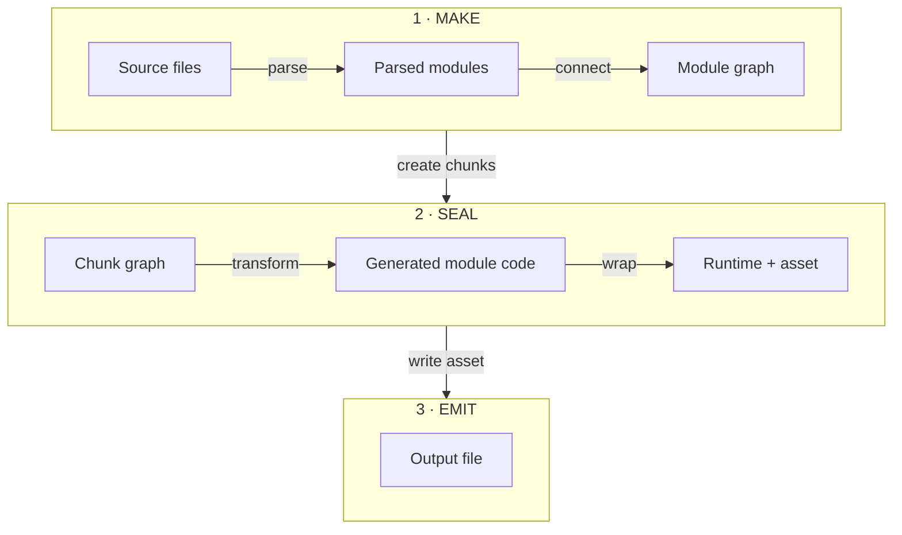
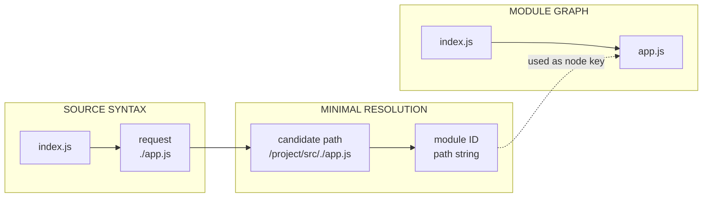
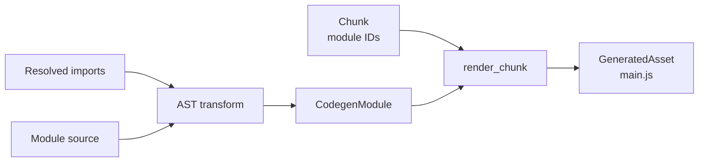
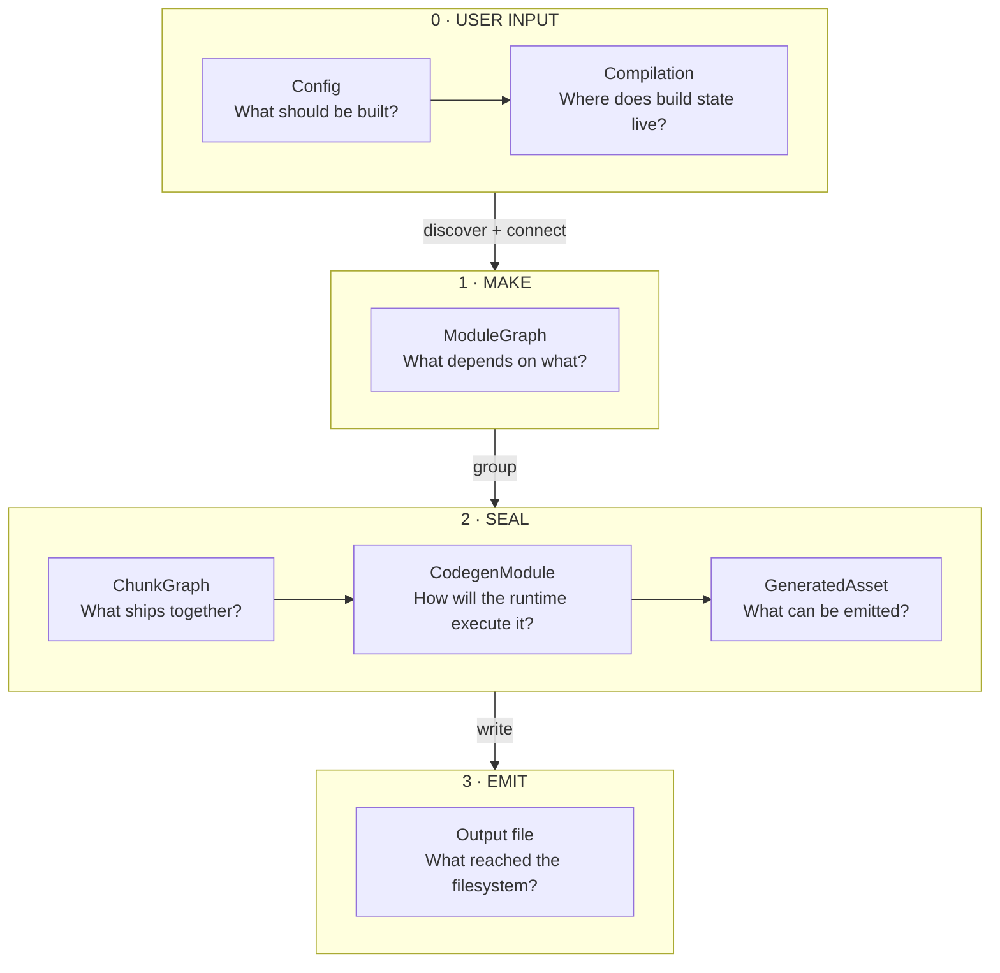

## A compiler shell is not yet a bundler

In [the previous post](/posts/feopack/), Feopack acquired a JavaScript API, a native binding, a playground, and a `Compilation` object.

Those names looked reassuring. They also hid an inconvenient fact: the compiler still did almost nothing.

:::commit-trail{title="Implementation trail · 9 commits"}
- [`4e15ec2`](https://github.com/atom-universe/feopack/commit/4e15ec2532fdc27f4e842b294b99f7c08438dae4) — name the module-graph skeleton
- [`54ee73d`](https://github.com/atom-universe/feopack/commit/54ee73dd55bf6c807edabb296b4788bc7f02e99e) — parse the entry with SWC
- [`686680b`](https://github.com/atom-universe/feopack/commit/686680b3609a84cd2edea56d71cc76d6f6664bab) — introduce the one-chunk boundary
- [`581cd45`](https://github.com/atom-universe/feopack/commit/581cd45fe1d6f55ea92dcda3b88797086c7eaa55) — expand the module graph with BFS
- [`0f834a9`](https://github.com/atom-universe/feopack/commit/0f834a9b0065ad1559d410674a2735f39db0dfd2) — render the first, still-invalid bundle
- [`b6dbeee`](https://github.com/atom-universe/feopack/commit/b6dbeee8802b9f9345caf3438b9a9f5460b14d92) — parse again during code generation
- [`163d1b4`](https://github.com/atom-universe/feopack/commit/163d1b472b8fb6af865ee1d76dda558063b4de31) — resolve imports and transform module syntax
- [`0fd82d9`](https://github.com/atom-universe/feopack/commit/0fd82d97be9c5fb2cbe795b6211e387d6b9a4284) — define exports through getters
- [`25c1de2`](https://github.com/atom-universe/feopack/commit/25c1de2d11be490a5f0e74cbe263daa2c20ae111) — support named imports and basic live bindings
:::

A real input file had to pass through a sequence of representations and operations before Feopack could write a usable output file:



These names come from the webpack-shaped compilation lifecycle rather than from the data structures themselves. I find them easier to remember this way:

- **`make` makes the compilation grow.** Starting from the entries, it builds modules and follows their dependencies until a module graph exists. In webpack, [`make` is a compiler hook](https://webpack.js.org/api/compiler-hooks/#make) that runs before the compilation is finished.
- **`seal` closes module discovery—for now.** webpack describes [`seal`](https://webpack.js.org/api/compilation-hooks/#seal) as the point where a compilation stops accepting new modules. Feopack used that boundary to turn its module graph into a chunk graph, generate module code, and create assets. A production compiler may reopen the compilation when additional work appears; this teaching implementation did not.
- **`emit` makes the result external.** The assets already exist in memory; this phase writes them to the configured output path.

That sequence is easy to read after the abstractions exist. It is less obvious while building them. Which representation should come first? How much JavaScript semantics must a “tiny” bundler preserve? When does a generated file become a bundle rather than a pile of concatenated source?

This part follows the commits that forced Feopack to answer those questions. Some early answers were intentionally incomplete. One of them produced a bundle that looked plausible and was not actually valid—which turned out to be much more educational than getting everything right immediately.

## 1. What should a source file become?

A bundler begins with files on disk, but a file path alone does not tell the compiler how the program is connected. The first useful representation is a module graph: modules become nodes, and imports become relationships between them.

The first relevant commit, [`4e15ec2`](https://github.com/atom-universe/feopack/commit/4e15ec2532fdc27f4e842b294b99f7c08438dae4), mostly established the vocabulary. `Compilation::make()` existed, but it only printed the entry path. Naming the representation before pretending to know how to build it was useful—but it was only a name.

That gap is worth noticing. Adding a type called `ModuleGraph` does not mean the compiler understands a program. What evidence would prove that it does?

For Feopack, the first evidence was much smaller: read one entry file, parse it, and observe its imports. In [`54ee73d`](https://github.com/atom-universe/feopack/commit/54ee73dd55bf6c807edabb296b4788bc7f02e99e), SWC turned the entry source into syntax the compiler could inspect.

Writing a JavaScript parser would have been a different project. SWC could provide the AST; Feopack still had to decide which parts of that AST mattered to a bundler.

At first, `make()` simply walked the module body and printed static import declarations. That was not a graph yet, but it changed the question from “what text is in this file?” to “which other modules does this file request?”

The simplified `Module` eventually looked like this:

```rust
pub struct Module {
  pub id: String,
  pub dependencies: Vec<String>,
}
```

Storing dependency request strings directly is not a strong long-term design. Incremental compilation, dependency categories, conditions, and richer graph queries would want more precise edge data. For this teaching implementation, the shape kept one fact visible: this module depends on those requests.

> This is one of the places where simplicity is useful only if it is named. `Vec<String>` was enough to expose the next problem; it was not presented as the dependency model a production bundler should keep forever.

## 2. Why create a chunk before the graph was complete?

After parsing the entry, the next commit did not teach Feopack how to follow its imports. [`686680b`](https://github.com/atom-universe/feopack/commit/686680b3609a84cd2edea56d71cc76d6f6664bab) introduced the packaging boundary first: a chunk graph placed the modules discovered so far into one output group—even though “so far” still meant only the entry module.

A module graph and a chunk graph answer different questions:

- **Module graph:** what has the compiler discovered, and how is the source program connected?
- **Chunk graph:** which discovered modules should ship together as a runtime unit?

The implementation had barely answered the first question, yet separating the second responsibility was still useful. Feopack's chunk structures were intentionally tiny:

```rust
pub struct Chunk {
  pub id: String,
  pub module_ids: Vec<String>,
}

pub struct ChunkGraph {
  pub chunks: Vec<Chunk>,
}
```

The chunking strategy was even smaller:

```rust
let chunk = Chunk {
  id: "main".to_string(),
  module_ids,
};
```

Every module known at that moment went into one chunk. No asynchronous chunks, no shared chunks, no CSS ordering, and no optimization pass.

Why introduce a `ChunkGraph` if it contains only one chunk? Because combining discovery with packaging would make the first implementation shorter while leaving every later chunking feature without a clear home.

The abstraction was ahead of the algorithm, but not ahead of the responsibility. In retrospect, this was a useful order: it established where chunking would happen before the module graph became large enough to distract from that boundary.

## 3. How does one discovered module become a graph?

Only the following commit, [`581cd45`](https://github.com/atom-universe/feopack/commit/581cd45fe1d6f55ea92dcda3b88797086c7eaa55), made `make()` follow static imports until no unvisited local module remained.

There is a small confession hiding in the history: the original commit subject says “build chunk graph by bfs.” Reading the diff now, that name was imprecise. The breadth-first traversal grew the **module graph**; `seal()` still copied the resulting module IDs into the single chunk. The code understood the distinction more clearly than my commit message did.

Imagine an entry containing this import:

```js
import title from "./app.js";

title("Hello Feopack");
```

Finding `./app.js` is only the beginning. The compiler must resolve that request relative to the importing file, avoid building the same path twice, and repeat the process for dependencies discovered inside `app.js`.

What is the smallest algorithm that makes those relationships visible?

A `VecDeque` and a `visited` set were enough for this stage:

```rust
queue.push_back(entry_path);

while let Some(module_path) = queue.pop_front() {
  if visited.contains(&module_path) {
    continue;
  }

  visited.insert(module_path.clone());

  let source = read_file(&module_path);
  let ast = swc_parse(source);
  let requests = collect_static_imports(ast);

  for request in requests {
    let dependency = resolve_path(request, module_path.parent());
    queue.push_back(dependency);
  }
}
```

This was deliberately not Rspack's scheduler. Rspack represents entries and dependencies with richer types, creates modules through factories, and schedules independent work in parallel. Feopack used a serial queue because the immediate lesson was graph expansion, not production scheduling.

Module identity already mattered, but the implementation had not yet earned the word *normalized*. `./app.js` was source syntax; the resolver turned it into a path string and used that string as a module ID. Different spellings of the same file could still become different IDs.



The distinction is important: request resolution chooses a file, while path canonicalization decides whether two spellings identify the same file. This commit attempted the former but did not solve the latter. It also did not implement package exports, aliases, directory resolution, or a general extension search.

At this stage, Feopack read JavaScript directly from disk. Loaders did not exist yet. They arrive in the next articles because the commit history demanded them later; backporting them into this phase would make the final architecture look cleaner while making the development story false.

## 4. Is wrapped source code already a bundle?

Once a chunk contained module IDs, Feopack could finally attempt to render an asset.

> **Commit [`0f834a9`](https://github.com/atom-universe/feopack/commit/0f834a9b0065ad1559d410674a2735f39db0dfd2) — Build the first bundle**
>
> Render the one-chunk graph into a module table, add a cache, and write the generated asset to disk.

The same commit added a small path-normalization pass that removed `.` components such as the one in `/src/./app.js`. It was enough for the playground case, but it did not canonicalize `..`, symbolic links, package identities, or filesystem case differences. “Stable module identity” was still a goal, not a property Feopack could honestly guarantee.

The first runtime used a familiar module table and cache:

```js
const modules = {
  "entry.js": function (module, exports, require) {
    // module source
  },
};

const cache = {};

function require(id) {
  if (cache[id]) return cache[id].exports;

  const module = { exports: {} };
  cache[id] = module;
  modules[id](module, module.exports, require);
  return module.exports;
}
```

It looked like a bundle. It had a runtime, module functions, a cache, and an entry call.

There was only one awkward detail: Feopack had wrapped the original sources without correctly lowering their ESM `import` and `export` syntax. An `import` declaration cannot simply remain inside an ordinary runtime function and hope for the best.

This is the point where I had to revise my definition:

> A bundle is not source code surrounded by a runtime. It is source code transformed to obey that runtime's module contract.

The failed output was useful because it revealed the missing boundary. The module graph knew which files were related, and the chunk graph knew which files belonged together, but code generation still had to translate source-level module semantics into runtime operations.

## 5. What information must survive parsing?

The next changes moved AST work into code generation and introduced explicit import records. [`b6dbeee`](https://github.com/atom-universe/feopack/commit/b6dbeee8802b9f9345caf3438b9a9f5460b14d92) stopped treating module source as an opaque string while rendering the bundle. Then [`163d1b4`](https://github.com/atom-universe/feopack/commit/163d1b472b8fb6af865ee1d76dda558063b4de31) connected source-level import requests to the module IDs used by the generated runtime.

At this point, Feopack only needed enough information for a default import:

```js
import title from "./app.js";
```

Even that small statement contains facts that must not collapse into one string:

- `title` is the local binding;
- `./app.js` is the request as the author wrote it;
- `/project/src/app.js` is the module identity the compiler resolved.

Feopack represented the source-facing information first:

```rust
pub struct RawImportRecord {
  pub local: String,
  pub request: String,
}
```

Resolution then added the runtime-facing identity:

```rust
pub struct ResolvedImportRecord {
  pub local: String,
  pub request: String,
  pub module_id: String,
}
```

There was no `imported` field yet because this version only collected default imports. Keeping both `request` and `module_id` still avoided mixing the user's syntax with the compiler's answer. The former was useful for diagnostics and semantic context; the latter was what the generated runtime needed.

The records stayed in a `Vec`. That preserved declaration and specifier order instead of discarding it behind a map chosen merely for convenient lookup.

With those records available, code generation could replace a default ESM import with a runtime lookup whose key came from resolution:

```js
const title = __feopack_import__("/project/src/app.js").default;
```

The generated module was no longer the original file. It became a temporary compiler-to-runtime representation:

```rust
struct CodegenModule {
  id: String,
  source: String,
}
```

This is where the data structures finally met:



## 6. Why is a named import not destructuring?

Default imports were enough to make one example work. Named imports exposed a deeper semantic question.

Consider this program:

```js
import { num, plusNum } from "./app.js";

console.log(num);
plusNum();
console.log(num);
```

If `num` were lowered as ordinary object destructuring, the local value could become a snapshot. But ESM imports are live bindings: after `plusNum()` updates the exported variable, reading `num` should observe the new value.

Before reading the implementation, how would you preserve that behavior in a tiny runtime?

Feopack's answer was to expose exports through getters and rewrite imported reads through the module namespace. The first half arrived in [`0fd82d9`](https://github.com/atom-universe/feopack/commit/0fd82d97be9c5fb2cbe795b6211e387d6b9a4284), which added getter-based export definitions instead of copying every exported value once.

> **Commit [`25c1de2`](https://github.com/atom-universe/feopack/commit/25c1de2d11be490a5f0e74cbe263daa2c20ae111) — Support named imports**
>
> Preserve basic live-binding behavior for the playground case and make import resolution explicit.

Those two commits supplied different halves of the answer. Getter-based exports kept the exported value observable, while named-import lowering stopped copying that value into a local variable. Instead, imported reads could remain property accesses on the module namespace.

Named imports also forced the import record to distinguish the name in the exporting module from the name visible locally. For `import { num as current }`, `num` is the imported name and `current` is the local binding:

```rust
pub struct RawImportRecord {
  pub local: String,
  pub imported: String,
  pub request: String,
}
```

`ResolvedImportRecord` carried the same three fields plus `module_id`. Neither distinction was ornamental: `imported` told the transformer that reads of `current` should observe the `num` export, while `module_id` identified the namespace that owned it.

The helper looked roughly like this:

```js
__feopack_import__.d = (exports, definition) => {
  for (const key in definition) {
    if (!Object.prototype.hasOwnProperty.call(exports, key)) {
      Object.defineProperty(exports, key, {
        enumerable: true,
        get: definition[key],
      });
    }
  }
};
```

The surrounding execution model still resembled a CommonJS module table: module functions received a module object, an exports object, and an import function. The getter-based export layer added a small piece of ESM-like behavior on top. Calling the whole runtime “ESM-style” would overstate what it implemented.

The supported syntax remained narrow:

- default and named static imports worked for the tested forms;
- exported variables, named functions, and named export lists had partial support;
- namespace imports were unsupported;
- anonymous `export default function` was unsupported;
- `export ... from` re-exports were unsupported;
- destructuring export declarations were unsupported.

These were not invisible footnotes. They marked the edge of the experiment. Every additional syntax form affects more than parsing: it can change graph construction, resolution, AST transformation, runtime helpers, and observable execution behavior.

## 7. Following the data all the way through

By this point, the useful mental model was no longer a feature checklist. It was a sequence of representations, each answering a different question.



The complete path was small but real:

1. JavaScript configuration crossed the NAPI boundary.
2. Rust created a fresh `Compilation`.
3. `make()` read files, parsed static imports, resolved local requests, and built a module graph.
4. `seal()` placed every module into one chunk.
5. Still inside `seal()`, code generation transformed a limited ESM subset and created a `GeneratedAsset`.
6. `emit_assets()` wrote that already-created asset to disk.

It was still far from a production bundler. There was no plugin system, no loader pipeline, no code splitting, no source maps, no tree shaking, no HMR, and no broad ESM compatibility at this point in the history.

That incompleteness was acceptable because it was visible. The project had answered one article-sized question: what representations are necessary for a JavaScript file to become executable output?

## Why this exercise still mattered

We are in a moment full of new tools, new workflows, new model capabilities, and new reasons to feel behind. I pay attention to those things too. It would be strange not to.

But independent technical judgment cannot come only from announcements, demos, or other people's conclusions. It needs contact with the thing itself.

Building Feopack made words such as module graph, chunk graph, live binding, and runtime concrete. More importantly, the incorrect first bundle showed something a clean architecture diagram would not: abstractions become trustworthy when the output puts them under pressure.

Writing about the process serves the same purpose. It leaves evidence of which model I began with, where it failed, and what had to change.

Or, to keep the original Chinese line that says this better than I can:

> 批五岳之图以为知山，不如樵夫之一足；谈沧溟之广以为知海，不如估客之一瞥；疏八珍之谱以为知味，不如庖丁之一啜。
> 及之而后知，履之而后艰，乌有不行而能知者乎？

The next commits asked Feopack to transform non-JavaScript inputs. That begins with one text file in [the next article](/posts/loaders-of-rspack/) and eventually grows into virtual modules, loader pitch, and JavaScript execution across the native boundary.
