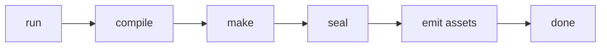
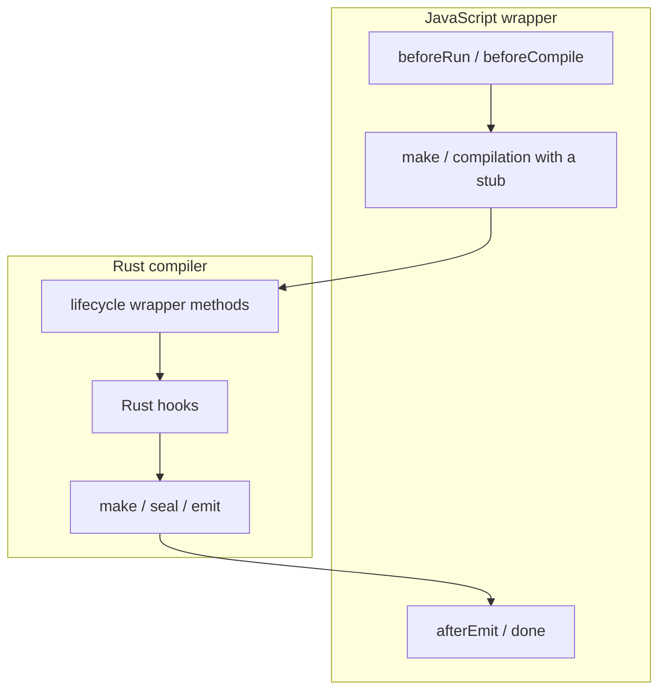
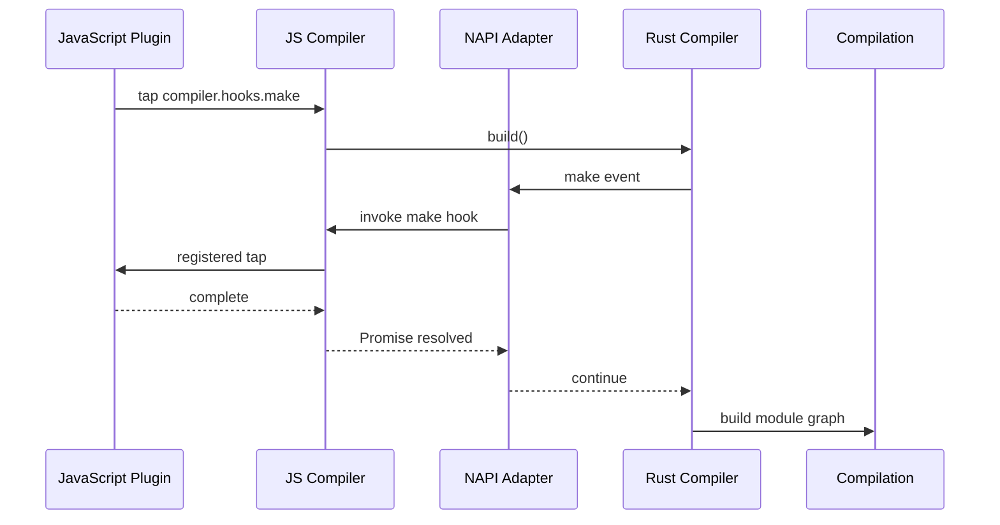

## The build already had a lifecycle

In the previous post, Feopack's loader system finally crossed the boundary between Rust and JavaScript.

A module could move through one ordered loader chain even when some steps ran in Rust and others ran in Node.js. That solved one kind of extensibility: outside code could participate in transforming a module.

:::commit-trail{title="Implementation trail · 13 commits"}
- [`3a4cafe`](https://github.com/atom-universe/feopack/commit/3a4cafe964ed09ae714ed15444fd480e1ee4fd5f) — make the compiler lifecycle visible
- [`22b30fc`](https://github.com/atom-universe/feopack/commit/22b30fc5cd46fd6fcaa4056a385e15c66bda9001) — separate asset emission from compilation
- [`6daf8ae`](https://github.com/atom-universe/feopack/commit/6daf8aedeffd17bc2d2094ebb2fd7f8e9fed1ae1) — scaffold compiler hooks
- [`5793525`](https://github.com/atom-universe/feopack/commit/5793525a589bdbf053d8a4a61035f7abbbf9bbc2) — compare the hook surface with Rspack
- [`5a0e844`](https://github.com/atom-universe/feopack/commit/5a0e844cd2c91df4eeda29d2224823b03dbe9c98) — clarify the missing hook capabilities
- [`9775b68`](https://github.com/atom-universe/feopack/commit/9775b6894d9c7819bafbea15183cc2194d5b802e) — implement ordered synchronous series hooks
- [`4207a1d`](https://github.com/atom-universe/feopack/commit/4207a1d071567d189334c22b2b48d67a8124a980) — let plugins affect compiler decisions
- [`be7732f`](https://github.com/atom-universe/feopack/commit/be7732f7cd1169ffb26683bf19e609dcc3e38dce) — extract loader orchestration from module building
- [`b0ee4e6`](https://github.com/atom-universe/feopack/commit/b0ee4e6b44a50e004188e85b9870b15f86093d84) — narrow plugin authority with `PluginDriver`
- [`7eac41e`](https://github.com/atom-universe/feopack/commit/7eac41e2ad26f1506bfa17e589ec85ffc329158e) — support minimal JavaScript compiler plugins
- [`45b3d5e`](https://github.com/atom-universe/feopack/commit/45b3d5e6b02c1ed6e2e0a9598c70ed020ed659df) — remove the lifecycle-wrapper abstraction
- [`a01dfaf`](https://github.com/atom-universe/feopack/commit/a01dfafbfba8b9a3c1052012f485ab82ba8b207d) — align hook timing with the runtime that owns each phase
- [`4d68877`](https://github.com/atom-universe/feopack/commit/4d68877c2570d49eddafa45cd1dfa87753ecc77c) — put the lifecycle under file-watching pressure
:::

It did not solve the larger problem.

A loader can change how one module becomes source the bundler understands. It does not naturally answer questions such as:

- What should happen before compilation starts?
- Can something observe every emitted asset?
- Can a build decide not to emit at all?
- When is a compilation actually finished?

Those questions belong to the compiler lifecycle rather than to one module.

Suppose you were adding plugins to this compiler. Would you begin by designing a hook API, or by naming the phases that API might expose? The second answer feels safer: before outsiders can enter the build, surely the compiler must know where its doors are.

That was my answer too.

Feopack already had a lifecycle. It could build a module graph, seal that graph into chunks, generate assets, and write those assets to disk. The missing part was a way for code outside the compiler to participate in those moments without being hard-coded into the main build function.

In other words, the build had a schedule, but it did not accept visitors.

```text
lifecycle = when the compiler does its work
hooks     = which moments the compiler exposes
plugins   = behavior attached to those moments
```

This post follows how I tried to connect those three ideas. The first version looked clean, acquired real Rust plugins, crossed into JavaScript, passed its test case, and was then partially deleted three days later.

It was a productive week.

The interesting question is not merely why it failed. It is why each step looked reasonable while I was building it.

## 1. Where should a plugin system begin?

Before implementing hooks, I separated the compiler flow into named lifecycle methods in [`3a4cafe`](https://github.com/atom-universe/feopack/commit/3a4cafe964ed09ae714ed15444fd480e1ee4fd5f). I wanted the order to become visible before attaching behavior to it.

```rust
pub async fn build(&mut self) -> Result<(), String> {
  self.initialize();
  self.before_run();
  self.run_lifecycle();

  self.compilation = Compilation::new(
    self.options.clone(),
    self.js_loader_runner.clone(),
  );

  self.compile().await?;
  self.done();
  Ok(())
}
```

The compile path had its own smaller sequence:

```rust
pub async fn compile(&mut self) -> Result<(), String> {
  self.before_compile();
  self.compile_lifecycle();
  self.compilation.make().await?;
  self.compilation.seal().await?;
  self.after_compile();
  self.emit_assets().await?;
  Ok(())
}
```

Each lifecycle method lived in a separate file. At this point, most of them did little more than print their name:

```rust
impl Compiler {
  pub(crate) fn before_run(&self) {
    println!("[rust compiler lifecycle] before_run");
  }
}
```

This was deliberately incomplete. None of these methods needed to be an extension point yet. For now, they only had to answer a smaller question: what does the compiler believe happens next?

Asset emission then moved into its own module in [`22b30fc`](https://github.com/atom-universe/feopack/commit/22b30fc5cd46fd6fcaa4056a385e15c66bda9001), making the boundary between generating an asset and writing it to disk explicit.



There is a useful difference between simplifying a system and pretending that the missing complexity does not exist. Production compilers have more states, failure paths, invalidation rules, and ownership concerns than this diagram shows. Feopack ignored most of them here because the immediate question was smaller: where does one build phase end and the next begin?

That small question was enough to create the first questionable abstraction.

Before continuing, look at the shape below and decide what it suggests. If a plugin wants to run at `beforeCompile`, where would you put it? If another wants to observe `done`, where would that belong?

The directory appeared to answer both questions before I had designed either hook.

## 2. Does every phase deserve a hook?

The lifecycle directory contained files such as:

```text
lifecycle/
  initialize.rs
  before_run.rs
  run.rs
  before_compile.rs
  compile.rs
  after_compile.rs
  emit.rs
  asset_emitted.rs
  after_emit.rs
  done.rs
```

It looked tidy. Every phase had a name, a file, and one obvious place to put future behavior.

That was precisely why I liked it.

It was also the beginning of a mistake. A lifecycle phase and a hook happened to share a name, so I started treating them as if they were the same abstraction. They are not.

The lifecycle is the compiler's control flow. `make()` must still build modules even when no plugin exists. `emit_assets()` must still write files when no one listens to `assetEmitted`. A hook is only an extension point placed at a selected moment in that control flow.

The trap was subtle: the directory did not merely describe the build. It encouraged me to believe that every named phase, wrapper method, and public hook should line up one-to-one.

Would that still make sense for a phase that must do real work even when no plugin is registered? I did not stop long enough on that question. First, I needed hooks that did something more useful than print their own names.

## 3. When does a hook become real?

The first `CompilerHooks` and `SyncSeriesHook` types arrived in [`6daf8ae`](https://github.com/atom-universe/feopack/commit/6daf8aedeffd17bc2d2094ebb2fd7f8e9fed1ae1), turning the list of phases into a list of explicit extension points.

```rust
pub(crate) struct CompilerHooks {
  pub(crate) initialize: SyncSeriesHook,
  pub(crate) before_run: SyncSeriesHook,
  pub(crate) run: SyncSeriesHook,
  pub(crate) before_compile: SyncSeriesHook,
  pub(crate) compile: SyncSeriesHook,
  pub(crate) after_compile: SyncSeriesHook,
  pub(crate) emit: SyncSeriesHook,
  pub(crate) asset_emitted: SyncSeriesHook,
  pub(crate) after_emit: SyncSeriesHook,
  pub(crate) done: SyncSeriesHook,
}
```

The name suggested progress. The implementation was slightly less impressive:

```rust
pub(crate) struct SyncSeriesHook {
  name: &'static str,
}

impl SyncSeriesHook {
  pub(crate) fn call(&self) -> Result<(), String> {
    println!("[rust hook] {}", self.name);
    Ok(())
  }
}
```

No taps. No plugin callbacks. Just a hook-shaped object announcing that it had been called.

A hook without taps is basically a very confident log statement, but the scaffold still served a purpose. It let the lifecycle call a stable object while I worked out what registration, context, ordering, and errors should look like.

I then paused to compare Feopack's small lifecycle with Rspack's capabilities. [`5793525`](https://github.com/atom-universe/feopack/commit/5793525a589bdbf053d8a4a61035f7abbbf9bbc2) recorded the gaps, and [`5a0e844`](https://github.com/atom-universe/feopack/commit/5a0e844cd2c91df4eeda29d2224823b03dbe9c98) clarified what those capability rows meant. This did not magically produce the right design, but it made one thing clear: copying a list of familiar hook names would not be enough. The important contract was what each hook received, when it ran, and whether it could affect the build.

## 4. What does “series” promise?

The placeholder became a real hook in [`9775b68`](https://github.com/atom-universe/feopack/commit/9775b6894d9c7819bafbea15183cc2194d5b802e), once it could store taps, call them in registration order, and propagate errors.

```rust
type TapFn<Ctx> =
  Box<dyn Fn(&Ctx) -> Result<(), String> + Send + Sync>;

pub(crate) struct SyncSeriesHook<Ctx> {
  name: &'static str,
  taps: Vec<Tap<Ctx>>,
}
```

Plugins could register callbacks with `tap()`. Calling the hook walked through them in registration order:

```rust
pub(crate) fn call(&self, ctx: &Ctx) -> Result<(), String> {
  for tap in &self.taps {
    (tap.function)(ctx).map_err(|error| {
      format!("{} tap {} failed: {}", self.name, tap.name, error)
    })?;
  }

  Ok(())
}
```

The two tests described the entire contract:

- taps run in registration order;
- the series stops when one tap returns an error.

This was not Rust Tapable. It did not support stages, interceptors, parallel hooks, or an elaborate family of hook types. That was intentional. Implementing every possible hook behavior before one real plugin needed it would have produced a beautiful abstraction with no evidence that I understood the problem.

For this step, I only needed to learn how ordered external behavior fits into a synchronous compiler phase.

Then one phase asked a different kind of question. If a hook is asking for a decision rather than announcing an event, should every tap still run?

## 5. Can a plugin stop the build?

Most lifecycle hooks notify every registered tap. `shouldEmit` is different. It asks whether the compiler should continue to asset emission.

If one plugin answers `false`, asking the remaining plugins for more answers is not especially useful. The hook should bail at the first value.

That question produced a small `SyncBailHook`:

> **Commit [`4207a1d`](https://github.com/atom-universe/feopack/commit/4207a1d071567d189334c22b2b48d67a8124a980) — Add compiler plugin hooks**
>
> Let the first explicit answer end the series, then use that behavior to control emission.

```rust
pub(crate) fn call(&self, ctx: &Ctx) -> Result<Option<Output>, String> {
  for tap in &self.taps {
    if let Some(result) = (tap.function)(ctx)? {
      return Ok(Some(result));
    }
  }

  Ok(None)
}
```

The compiler could now ask the hook before emitting:

```rust
let should_emit = self
  .hooks()
  .should_emit
  .call(&())?
  .unwrap_or(true);

if !should_emit {
  return Ok(());
}
```

This also produced Feopack's first real Rust plugins.

```rust
pub trait Plugin {
  fn apply(&self, compiler: &mut Compiler) -> Result<(), String>;
}
```

`TraceLifecyclePlugin` tapped several hooks and wrote their order to a log file. `SkipEmitPlugin` tapped `shouldEmit` and returned `false`:

```rust
impl Plugin for SkipEmitPlugin {
  fn apply(&self, compiler: &mut Compiler) -> Result<(), String> {
    compiler
      .hooks_mut()
      .should_emit
      .tap("SkipEmitPlugin", |_| Ok(Some(false)));

    Ok(())
  }
}
```

The playground cases checked two concrete behaviors: lifecycle taps ran in the expected order, and a plugin could prevent files from being emitted.

That was the first point where “plugin system” meant more than a directory full of promising type names.

It was still a narrow teaching implementation. Rust plugins were selected from a built-in name table, hook contexts were tiny, and arbitrary compilation mutation was not a stable public contract. The point was not to claim webpack compatibility. The point was to prove that a plugin could observe or alter one real compiler decision.

## 6. How much compiler should a plugin receive?

What is the smallest amount of authority a plugin needs to register behavior?

I gave it the largest amount available: `&mut Compiler`.

A plugin that only wanted to register a hook could also reach compiler options, compilation state, loader configuration, and any future mutable field added to `Compiler`. The API made the easiest implementation possible by making the boundary almost meaningless.

Before fixing that, [`be7732f`](https://github.com/atom-universe/feopack/commit/be7732f7cd1169ffb26683bf19e609dcc3e38dce) moved `LoaderRunner` out of the module-building path. The previous post covered that refactor in detail; here it mattered because the compiler was gradually becoming an orchestrator instead of the permanent home for every subsystem.

The next change, [`b0ee4e6`](https://github.com/atom-universe/feopack/commit/b0ee4e6b44a50e004188e85b9870b15f86093d84), introduced `PluginDriver` and gave plugins a smaller registration context instead of a master key to the compiler:

```rust
#[derive(Default)]
pub(crate) struct PluginDriver {
  compiler_hooks: CompilerHooks,
  plugins: Vec<Box<dyn Plugin>>,
}
```

Plugins no longer received the complete compiler. They received a smaller application context:

```rust
pub struct PluginApplyContext<'a> {
  pub(crate) compiler_hooks: &'a mut CompilerHooks,
  pub(crate) compiler_options: &'a CompilationOptions,
}

pub trait Plugin: Send + Sync {
  fn apply(&self, context: &mut PluginApplyContext)
    -> Result<(), String>;
}
```

This boundary was easier to reason about:

```text
Compiler
  -> owns PluginDriver
       -> owns CompilerHooks
       -> applies and keeps Rust plugins
```

The driver did not make the system complete. It did make ownership more explicit. Inside the core, a built-in plugin could register behavior and inspect configuration without receiving a master key to every mutable compiler field. This was not yet a polished public Rust plugin API.

With the Rust side working, I moved to the more interesting boundary: ordinary JavaScript plugins.

## 7. Can a familiar API cross the boundary?

The Rust side could now register native plugins. [`7eac41e`](https://github.com/atom-universe/feopack/commit/7eac41e2ad26f1506bfa17e589ec85ffc329158e) then implemented just enough of a familiar Tapable-shaped API to exercise one real JavaScript plugin.

```ts
compiler.hooks.done.tap("ExamplePlugin", stats => {
  console.log(stats)
})
```

`MiniSeriesHook` supported the three common registration styles:

```ts
hook.tap(name, fn)
hook.tapAsync(name, fn)
hook.tapPromise(name, fn)
```

Internally, all three became an ordered list of taps. The promise path normalized synchronous returns, callbacks, and promises into one serial execution model.

Again, the prefix “Mini” was doing important legal work. This hook did not implement Tapable's stages, interceptors, `HookMap`, or its full collection of series, bail, waterfall, and parallel behavior. It implemented the smallest familiar API needed by one real plugin.

That real plugin was `webpack-shell-plugin-next`.

```js
module.exports = {
  entry: "./src/index.js",
  plugins: [
    new WebpackShellPluginNext({
      onBeforeNormalRun: {
        scripts: [appendLog("beforeRun")],
        blocking: true,
      },
      onBeforeCompile: {
        scripts: [appendLog("beforeCompile")],
        blocking: true,
      },
      onBuildEnd: {
        scripts: [appendLog("afterEmit")],
        blocking: true,
      },
      onBuildExit: {
        scripts: [appendLog("done")],
        blocking: true,
      },
    }),
  ],
}
```

The test expected this sequence:

```text
beforeRun
beforeCompile
make
compilation
afterEmit
done
```

If you saw this result in an integration test, what would you conclude? A real webpack plugin had registered familiar hooks, performed visible work, and produced the expected order.

And it passed.

This was a satisfying moment. An existing webpack plugin could receive familiar hooks from a Rust-based learning bundler and perform visible work.

It was tempting to call the boundary correct. Before doing that, however, there was a more precise question to ask: what, exactly, had the test proved?

## 8. What did the passing test actually prove?

The first JavaScript implementation called most hooks around one opaque native build:

```ts
await this.hooks.beforeRun.promise(this)
await this.hooks.beforeCompile.promise({})
await this.hooks.make.promise(compilationStub)
await this.hooks.compilation.promise(compilationStub)

await inner.build()

await this.hooks.afterEmit.promise(this.compilation)
await this.hooks.done.promise(stats)
```

The test proved that JavaScript observed six familiar names in the expected order. It did not prove that those names referred to the real compiler moments.

`make` did not run when Rust actually built the module graph. `compilation` received a stub because the JavaScript wrapper did not yet have the real wrapper object. `afterEmit` ran after the whole native build returned rather than being attached to the native emit phase.

The hook names resembled the compiler lifecycle. Their timing only approximated it.

I had created two overlapping stories:



One lifecycle lived in Rust. Another lifecycle-shaped sequence lived in JavaScript. The separate Rust lifecycle files added a third layer of ceremony between the compiler and its hooks.

This is where the distinction became unavoidable:

- lifecycle phases perform the build;
- hooks expose selected moments in those phases;
- plugins attach behavior to the hooks.

Giving all three things similar names had made the code look aligned before the timing was actually aligned.

## 9. Which abstraction needed to disappear?

Three days after the JavaScript plugin case passed, the next commit acquired a memorable name:

```text
refactor: I give up the hooks, and be going to align rspack
```

> **Commit [`45b3d5e`](https://github.com/atom-universe/feopack/commit/45b3d5e6b02c1ed6e2e0a9598c70ed020ed659df) — “I give up the hooks”**
>
> Delete the lifecycle wrapper directory, but keep the hook system it helped reveal.

The grammar was not having its best evening, but the frustration was accurately recorded.

The commit deleted the entire `compiler/lifecycle` directory: twelve files disappeared, including `before_run.rs`, `compile.rs`, `emit.rs`, and `done.rs`.

It did not actually delete the hook system.

What I gave up was the idea that every named hook deserved a lifecycle wrapper method and a separate file. Those wrappers were not the lifecycle. They were forwarding layers around the lifecycle, and most of them existed only because the hook list existed.

This is an important kind of deletion in a learning project. The first abstraction was not useless. It made the phases visible, gave me somewhere to attach the first hooks, and exposed the duplication clearly enough that I could remove it with confidence.

Temporary scaffolding is allowed to teach one lesson and then leave the building.

## 10. Who owns the compiler's time?

The correction began with an ownership question: which runtime actually knows when a phase occurs?

Rust knew when the module graph was built and when assets were emitted. JavaScript owned the public compiler API and its plugin objects. Neither side could safely imitate the other's clock.

> **Commit [`a01dfaf`](https://github.com/atom-universe/feopack/commit/a01dfafbfba8b9a3c1052012f485ab82ba8b207d) — Align compiler hooks with Rspack**
>
> Keep outer API orchestration in JavaScript and emit internal lifecycle events from the Rust phases that perform the work.

The JavaScript `Compiler` kept the outer lifecycle that naturally belongs to the JavaScript-facing API:

```ts
async run() {
  await this.hooks.beforeRun.promise(this)
  await this.hooks.run.promise(this)

  const compilation = await this.compile()
  const stats = compilation.getStats()

  await this.hooks.done.promise(stats)
  this.hooks.afterDone.call(stats)
}
```

The Rust `Compiler` directly orchestrated the work that happens inside the native build:

```rust
pub async fn build(&mut self) -> Result<(), String> {
  self.compilation = Compilation::new(
    self.options.clone(),
    self.js_loader_runner.clone(),
  );

  self.compile().await?;
  self.compile_done().await?;
  Ok(())
}
```

When Rust reached a real internal phase, it could call the corresponding Rust hook and forward an event to JavaScript:

```rust
async fn build_module_graph(&mut self) -> Result<(), String> {
  self.call_js_compiler_hook("thisCompilation", None, None)
    .await?;
  self.call_js_compiler_hook("compilation", None, None)
    .await?;

  self.hooks().make.call(&())?;
  self.call_js_compiler_hook("make", None, None).await?;

  self.compilation.build_module_graph().await
}
```

The same pattern covered `emit`, `assetEmitted`, and `afterEmit`. A small NAPI adapter carried those events back into the JavaScript wrapper, where they called the public hooks with JavaScript-facing objects.



The final split was much clearer:

- The JavaScript `Compiler` owns the public API, JavaScript plugins, outer hooks, and JavaScript-facing `Compilation` and `Stats` objects.
- The Rust `Compiler` owns native orchestration and the exact timing of internal build phases.
- `Compilation` owns module graph building, sealing, and generated assets.
- `PluginDriver` owns Rust hooks and built-in Rust plugins.
- The NAPI adapter crosses the boundary only when an internal Rust phase must notify JavaScript.

This was still not Rspack's full plugin architecture. Rspack provides richer hook types, more precise payloads, more lifecycle points, and a more developed native-to-JavaScript registration system. Feopack compressed its native hook bridge into one event callback and exposed only the contexts needed by its examples.

That simplification was acceptable because the article-sized question now had a real answer: a plugin callback ran at the compiler phase whose name it carried, rather than somewhere vaguely before or after one large native function.

## 11. What should survive this experiment?

At the end of this sequence, Feopack had not become webpack or Rspack. It had learned a smaller set of lessons.

First, a lifecycle exists even when no hooks exist. It is the compiler's own control flow and must remain understandable without reading the plugin implementation.

Second, a hook is a contract, not a log statement with a famous name. Its timing, context, ordering, error behavior, and ability to affect the build matter more than whether its name appears in a familiar list.

Third, a plugin should receive the authority it needs rather than a mutable reference to the entire world. `PluginApplyContext` and `PluginDriver` were small steps toward that boundary.

Fourth, crossing Rust and JavaScript is not only a data-conversion problem. Both runtimes need to agree on who owns the lifecycle. Otherwise, each side starts performing its own convincing imitation of the same build.

Finally, a passing compatibility case is evidence, not absolution. `webpack-shell-plugin-next` proved that the public hook shape was useful. It did not prove that the first internal placement of those hooks was correct.

The resulting system remained intentionally incomplete:

- JavaScript hooks implemented only a small serial subset of Tapable.
- Rust hooks covered only the lifecycle points needed by current cases.
- Hook payloads were minimal.
- Plugin mutation and compatibility guarantees remained narrow.
- The single native-to-JavaScript event adapter favored clarity over the architecture of a production bundler.

Those limits were not hidden. They marked the edge of the experiment.

The next feature, basic file watching in [`4d68877`](https://github.com/atom-universe/feopack/commit/4d68877c2570d49eddafa45cd1dfa87753ecc77c), immediately put the new lifecycle boundary under pressure: who owns repeated compilations, which hooks belong to a watch cycle, and what happens when a file changes while a build is already running?

Apparently, once a compiler learns to accept visitors, someone eventually asks it to stay awake.
