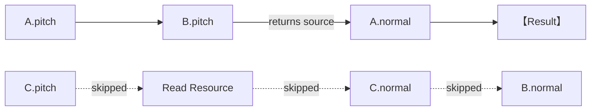
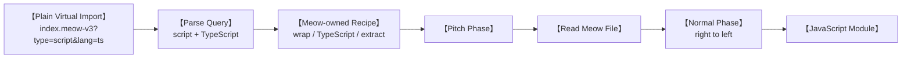
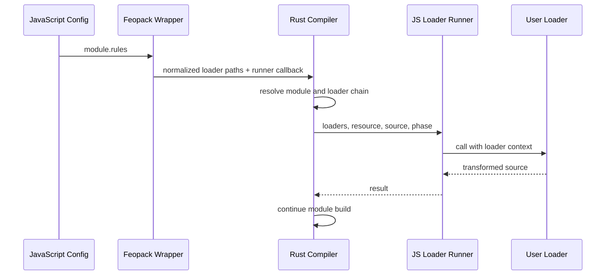
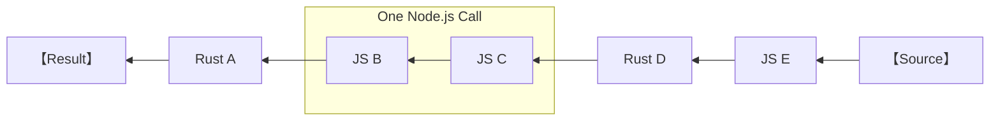
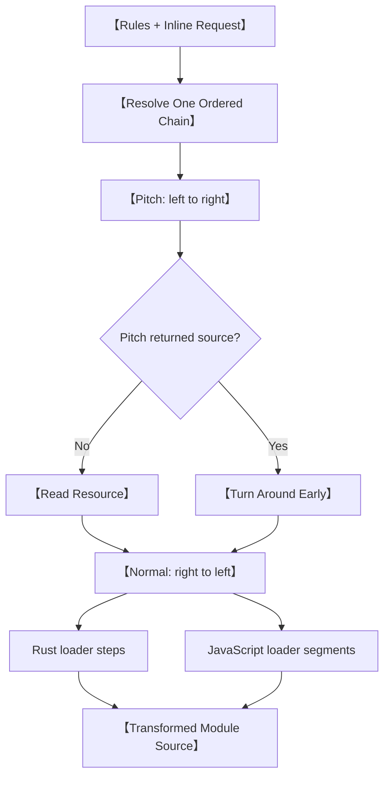

## The loader chain has learned enough punctuation

In the previous post, Feopack's loader system grew from one Rust function into something much more useful.

It could match files with rules, run several transformations in a chain, split one Meow file into virtual modules, and attach an exact loader recipe to each virtual request.

That last part worked, but the generated imports looked like this:

```js
import __script__ from "-!meow-wrap-script-export!typescript-loader!meow-extract-script!./index.meow-v2?type=script&lang=ts";
```

There is nothing fundamentally wrong with an inline loader request. Webpack supports them for a reason. The problem was that Meow v2 had to write its entire internal implementation into generated source code.

The main loader needed to know every child loader by name. Changing the script pipeline meant changing the import string. Anyone inspecting the generated module received a small wall of punctuation as a bonus.

I wanted the generated request to become simple again:

```js
import __script__ from "./index.meow-v3?type=script&lang=ts";
```

At roughly the same time, another limitation was becoming impossible to ignore. Every loader in Feopack was compiled into Rust. That was convenient for my experiment, but it was not much of an extension system. A user could select one of my loaders; they could not write their own.

These looked like two different tasks:

- Give loaders a `pitch` phase so the pipeline could make decisions before reading a resource.
- Let ordinary JavaScript files participate in the same loader chain as native Rust loaders.

They eventually became one problem: Feopack needed a real loader runner, not just a loop over Rust functions.

## 1. A loader is more than its normal function

Until this point, Feopack only knew the part of a loader that transforms source.

Given three loaders, the source travels from right to left:

```text
source -> loader-c -> loader-b -> loader-a -> result
```

This is often called the normal phase. It is the part most people mean when they first learn about loaders: receive some content, transform it, and return the next version.

Webpack-style loaders also have an optional `pitch` function. Pitch functions run before the resource is read, and they travel in the opposite direction: from left to right.


The complete path resembles walking down one side of a street and returning along the other. Pitch goes forward, the resource sits at the turning point, and normal transformations come back in reverse order.

Feopack represented that shape explicitly:

```rust
pub struct Loader {
  pub pitch: Option<PitchFn>,
  pub normal: NormalFn,
}

pub enum PitchResult {
  Continue,
  ShortCircuit(String),
}
```

Most loaders only need `normal`. Their pitch function is simply absent. A loader that does need to inspect or redirect the request can provide both.

This machinery arrived in `2d04387`.

## 2. Pitch can turn the pipeline around early

The important part of pitch is not merely that it runs first. A pitch function can return a value.

Suppose `B.pitch` returns some source:

```text
A.pitch -> B.pitch -> return source
```

Feopack no longer needs to continue to `C.pitch`, and it does not need to read the resource from disk. The returned value becomes the input for the normal loaders to the left of `B`.



That early return is usually called a short circuit. The loader that returns from pitch does not run its own normal function. The pipeline turns around immediately before it.

Why would a loader do this?

It may already know how to produce the module without reading the original file. It may want to redirect work to another request. Or it may be coordinating several loaders and decide that the normal resource path is no longer the right route.

For Feopack, the first benefit was architectural. Resource loading could no longer happen at the top of the function by habit. The sequence had to become explicit:

```rust
let pitched = run_pitch_chain(&context, &loader_chain)?;

let source = match pitched {
  Some(source) => source,
  None => read_resource_file(&resource_path).await?,
};

run_normal_chain(context, &loader_chain, source)?
```

The loader runner was beginning to control how a module obtained its source, rather than merely decorating source that the compiler had already read.

That distinction became useful immediately.

## 3. Meow v3 hides the recipe again

Meow v3 kept the same virtual-module idea as Meow v2. The main request still inspected one file and generated child requests for its blocks:

```js
import __template__ from "./index.meow-v3?type=template";
import __script__ from "./index.meow-v3?type=script&lang=ts";
import __style__ from "./index.meow-v3?type=style&scoped";
```

The difference was what happened after Feopack saw one of those requests.

The query now described the kind of block, while Meow's own loader logic selected the corresponding chain:

```text
?type=template
  -> wrap template export
  -> extract template

?type=script&lang=ts
  -> wrap script export
  -> transform TypeScript
  -> extract script

?type=style&scoped
  -> wrap style export
  -> scope selectors
  -> extract style
```

The first Meow v3 commit still had several query-specific rules. That was useful because it proved the pitch and normal traversal worked, but it had not really solved the rule explosion from the previous chapter.

The next commits simplified the registrations and finally moved the Meow-specific decision next to the Meow loader itself:

```rust
pub fn resolve_meow_v3_chain(query: &str) -> Result<Vec<String>, String> {
  let mut chain = vec!["meow-v3-pitcher".to_string()];

  if query.is_empty() {
    chain.push("meow-loader-v3-main".to_string());
    return Ok(chain);
  }

  let block = meow_block_from_query(query)?;
  chain.extend(block_loader_names(&block));
  Ok(chain)
}
```

This is a modest piece of code, but its location matters.

The generic registry knows how to match resources and assemble a loader chain. It should not need a growing list of facts about Meow blocks. The Meow loader knows what `type=script`, `lang=ts`, and `scoped` mean, so it is the natural place to translate those details into a recipe.



The generated import became readable again, and the generic rule table stopped pretending it understood the private structure of every file format.

This progression happened across `2d04387`, `bcbecf8`, and `e5922b9`. I like this sequence because the first implementation did not magically choose the final home for every responsibility. It made the behavior work, then moved knowledge closer to the code that owned it.

## 4. A registry of Rust functions is still a closed world

At this stage, a loader in Feopack was essentially a pair of Rust function pointers registered under a name:

```rust
loader_registry.register_loader(
  "text-loader".to_string(),
  Loader::normal_only(text_loader),
);
```

That is fast and easy to reason about. It is also not how a JavaScript developer expects to extend a bundler.

They expect to write a file like this:

```js
module.exports = function upperLoader(source) {
  const value = String(source).toUpperCase();
  return `export default ${JSON.stringify(value)};`;
};
```

Then they expect to reference it from configuration:

```js
module.exports = {
  module: {
    rules: [
      {
        test: ".demo",
        use: [require.resolve("./loaders/upper-loader.js")],
      },
    ],
  },
};
```

Rust cannot execute that function. Node.js can.

This means the compiler has to cross the language boundary in the opposite direction from normal configuration. At startup, JavaScript calls into Rust to create the compiler. During module building, Rust sometimes has to call back into JavaScript to run user code.



The JavaScript wrapper passed two kinds of things into the native compiler:

- Plain data describing rules and loader paths.
- A callable loader runner that Rust could invoke later.

On the Rust side, a request to that callback contained the active phase, loader paths, resource, current source, and project root. On the Node.js side, the runner loaded the JavaScript module and called it with a webpack-like loader context.

That context is why loaders use `this` rather than receiving every capability as a positional argument:

```js
module.exports = function exampleLoader(source) {
  console.log(this.resourcePath);
  this.addDependency("./another-file.txt");
  return source;
};
```

Feopack's first JavaScript loader support landed in `8d71105`. The loader runner itself was adapted from webpack's model, including the distinction between synchronous returns, callbacks, and async loaders. The ecosystem-compatible shape was more valuable than inventing a slightly prettier API that no existing loader understood.

For the first time, Feopack's loader configuration was genuinely extensible. Then the test case became slightly more ambitious, and the first design fell apart.

## 5. Two correct chains can still produce the wrong result

The first bridge separated the selected loaders into two lists:

```rust
pub fn split_loader_chain(chain: &[String]) -> (Vec<String>, Vec<String>) {
  // native names go into one list
  // JavaScript paths go into another
}
```

It is an understandable first attempt. Run the Rust loaders in Rust, run the JavaScript loaders in Node.js, and pass the result between them.

But loader order is part of the program.

Consider this configured chain:

```text
[Rust A, JavaScript B, Rust C]
```

The normal phase must execute it from right to left:

```text
Rust C -> JavaScript B -> Rust A
```

If we group by runtime, we get something like this instead:

```text
Rust C -> Rust A -> JavaScript B
```

Every individual loader still runs. Every runtime does its own work correctly. The combined answer is wrong because the original order disappeared.

This was easy to expose with a marker loader. Feopack configured one native text loader and one JavaScript loader that inserted a visible string. The generated bundle could then reveal whether JavaScript ran before or after the Rust transform.

The lesson was simple: a mixed loader chain is still one chain. Runtime is an execution detail, not a reason to reorder it.

## 6. Keep one chain and cross the boundary in segments

The corrected runner kept one normalized list with stable positions:

```text
[Rust A, JS B, JS C, Rust D, JS E]
```

Pitch still walked from left to right. Normal still walked from right to left. When the traversal reached JavaScript, Feopack collected only the adjacent JavaScript loaders into a segment and sent that segment to Node.js.



This preserved the global order while avoiding a separate Rust-to-JavaScript call for every adjacent JS loader.

Pitch added one extra requirement: the runner had to remember exactly where a short circuit happened.

If the third loader returned during pitch, normal execution could not simply start from the end of the chain. It had to turn around immediately before that loader. A JavaScript segment therefore returned not only source, but also whether it short-circuited and the position of the loader that did so:

```rust
pub struct JsLoaderRunResult {
  pub source: String,
  pub short_circuit: bool,
  pub pitched_loader_index: Option<usize>,
}
```

The local index inside the JavaScript segment was converted back into an index in the complete mixed chain. That one number told Rust where the reverse traversal should begin.

This version arrived in `814f880`. It is the commit where the Rust and JavaScript implementations stopped behaving like two neighboring pipelines and became two executors for the same pipeline.

## 7. The module builder should not conduct this orchestra

The mixed-chain implementation worked, but most of it lived inside `make.rs`.

That file was already responsible for building modules, following dependencies, updating the graph, and storing transformed source. It now also knew how to:

- Traverse pitch loaders.
- Detect JavaScript loader paths.
- Group adjacent JavaScript loaders.
- Call through NAPI.
- Translate segment indices back to global indices.
- Traverse the normal phase in reverse.

The compiler could technically build modules, but the module builder had started a second career as an air-traffic controller.

The refactor in `be7732f` extracted a dedicated `LoaderRunner`:

```rust
pub struct LoaderRunner<'a> {
  loader_registry: &'a LoaderRegistry,
  js_loader_runner: Option<&'a JsLoaderRunner>,
  project_root: &'a str,
}
```

The module-building path became readable again:

```rust
let (pitched_source, normal_start) = runner
  .run_pitch_chain(&pitch_context, &loader_chain)
  .await?;

let source = match pitched_source {
  Some(source) => source,
  None => self.read_resource_file(module_path).await?,
};

runner
  .run_normal_chain(normal_context, &loader_chain, normal_start, source)
  .await
```

This is more than moving code into another file. It gives the compiler a clean boundary.

The module builder owns the question, “Which module are we building?” The loader runner owns the question, “How does this chain produce that module's transformed source?”

Once that boundary existed, Rust loaders and JavaScript loaders no longer needed separate stories in the rest of the compiler. They were both steps selected for one module build.

## 8. What the loader system had become

The first Feopack loader was a Rust function that wrapped text in JavaScript. By the end of this chapter, the system had several distinct responsibilities:



- Rules and resource queries decide which transformations belong to a module.
- Pitch gives loaders a phase before resource reading and a way to short-circuit.
- Normal functions transform source in reverse order.
- The JavaScript bridge lets users provide behavior that is not compiled into Feopack.
- The mixed runner preserves one ordering model across Rust and Node.js.
- The module builder receives transformed source without owning the orchestration details.

None of these pieces was especially large by itself. The difficulty came from keeping their order and ownership clear.

That is also why “just call JavaScript from Rust” is not a complete design. The callback is the easy part. The real contract includes when the callback runs, which loaders are included, what source it receives, what its result means, and where execution resumes afterward.

Feopack now had a module-level extension pipeline. A loader could participate in building one resource, whether its implementation lived in Rust or JavaScript.

The next question was larger in scope.

How could outside code participate in the compiler lifecycle itself—before compilation, during `make`, before emitting assets, or after the build completed?

That led to the plugin driver, JavaScript compiler plugins, and my brief attempt to invent a hook system before deciding that Rspack had already left enough clues.

That story can wait for the next chapter. This one has crossed enough boundaries already.
