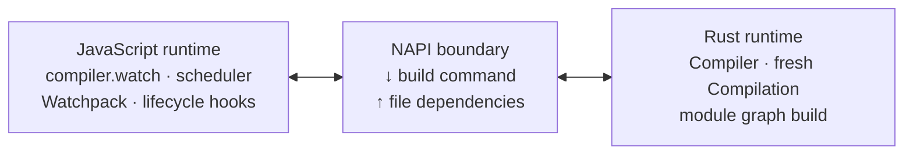
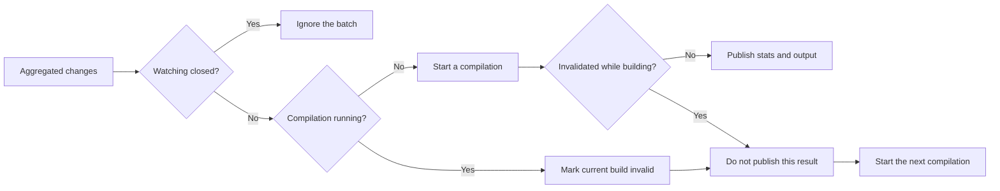
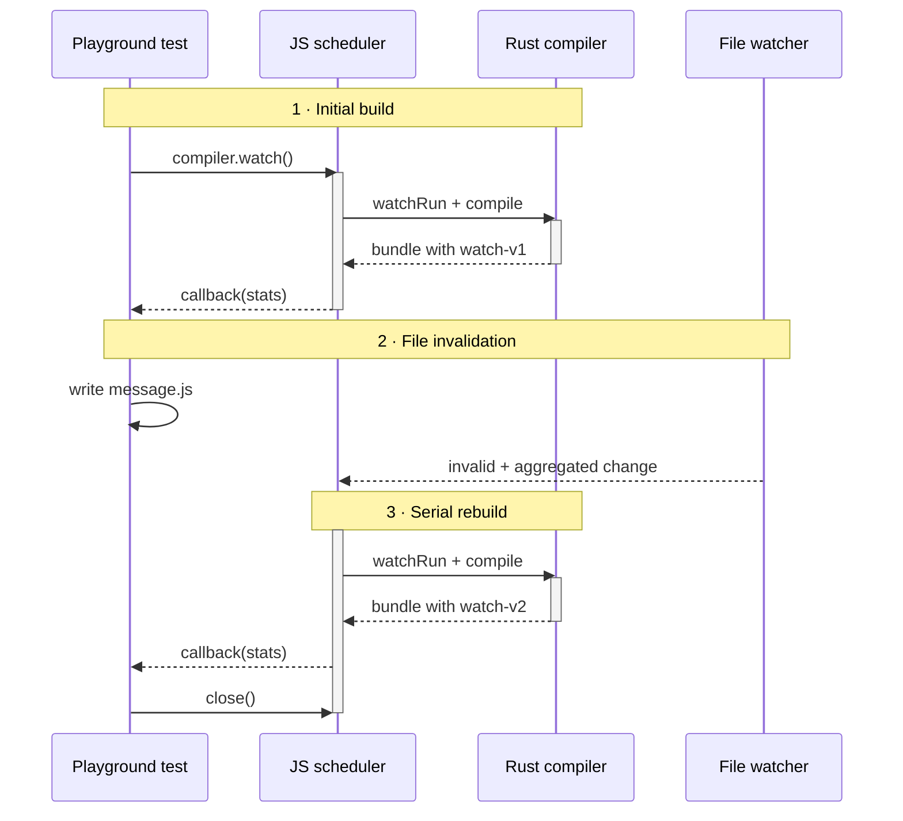

## Rebuild when a file changes. How hard could that be?

At the end of [the previous post](/posts/feopack-loaders-and-hooks/), Feopack finally had a compiler lifecycle that meant what it said.

JavaScript owned the public `Compiler` and its plugins. Rust owned the native build phases. Hooks crossed the boundary at the moments when the corresponding work actually happened.

The next feature looked almost too small to deserve another chapter:

```text
when a file changes:
  build again
```

That is a reasonable description of watch mode. It is also incomplete in nearly every interesting way.

Which files should the compiler watch? What if an editor produces several events for one save? What if a file changes while the previous build is still running? Should that build finish, be cancelled, or be allowed to publish output that is already stale?

The moment a compiler repeats itself, time becomes part of its architecture.

:::commit-trail{title="Implementation snapshot · 1 commit"}
- [`4d68877`](https://github.com/atom-universe/feopack/commit/4d68877c2570d49eddafa45cd1dfa87753ecc77c) — add dependency collection, Watchpack orchestration, watch hooks, and a rebuild case
:::

> Unlike the earlier chapters, Git does not preserve the intermediate steps of this experiment. Most of the watch loop landed in one commit. What follows is therefore a reconstruction of the design pressures visible in the implementation, not a claim that I solved them in this exact order.

## 1. Can we watch a build before it exists?

The most obvious implementation would watch the entry file:

```js
watch(entry, () => compiler.run())
```

That works until the entry imports another module.

```js
// index.js
import { message } from "./message.js";

console.log(message);
```

Changing `message.js` should trigger a rebuild too. So should changing any other file that became part of the module graph.

We could watch the entire project directory instead. That would catch the dependency, but it would also catch unrelated files—and, unless we were careful, the bundle Feopack had just written into `dist`. A compiler that rebuilds because it emitted a file has invented a surprisingly effective infinite loop.

The build itself already had the most precise answer available. Every time Feopack built a module, it knew which resource backed that module. The Rust `Compilation` began recording those paths:

```rust
let module_path = create_data.resource_path.clone();

self
  .file_dependencies
  .insert(Self::normalize_path(&module_path)?);
```

After the build, that set crossed NAPI and appeared on the JavaScript `Compilation`:

```ts
get fileDependencies(): ReadonlySet<string> {
  return new Set(this.#inner.getFileDependencies())
}
```

The order is important:


Feopack could not know the complete watch set before its first compilation, because discovering dependencies was one of the things compilation did. Watch mode was therefore not “watch, then build.” It was “build, learn what mattered, then watch.”

That set was still deliberately incomplete. Production bundlers distinguish file dependencies, directory or context dependencies, missing dependencies, build dependencies, and dependencies introduced by loaders or plugins. Feopack recorded only resource files that successfully became modules.

That was enough for the teaching case. It was not enough to claim that every relevant filesystem change could be observed.

## 2. Which runtime should stay awake?

Feopack now knew what to watch. It still needed something to interact with the filesystem over time.

I could have put a watcher in Rust. Instead, the JavaScript layer used [Watchpack](https://github.com/webpack/watchpack), the watcher library used in the webpack ecosystem. Watchpack normalizes lower-level watching behavior, accepts sets of files, directories, and missing paths, and can combine changes that happen close together into one `aggregated` event.

This kept a useful ownership boundary:



Rust still performed the expensive compiler work. JavaScript owned the long-lived public API, plugin hooks, callbacks, and the watcher already designed for Node.js tooling.

This was not an argument that watchers must always live in JavaScript. It was a smaller decision: Feopack already had an ecosystem-shaped JavaScript shell, so keeping watch orchestration there avoided creating a second long-lived control plane across the native boundary.

## 3. Is every filesystem event a rebuild?

A single save is not guaranteed to look like a single event.

An editor may write a temporary file, replace the original, update metadata, or touch several generated files. Starting a build for each notification would turn an implementation detail of the editor into the compiler's scheduling policy.

Feopack gave Watchpack an `aggregateTimeout` and listened at two different levels:

```ts
this.#watcher.on('change', (file, modifiedTime) => {
  this.#reportInvalid(file, modifiedTime)
})

this.#watcher.on('remove', (file) => {
  this.#reportInvalid(file, Date.now())
})

this.#watcher.on('aggregated', (changes, removals) => {
  this.#mergeChanges(changes, removals)
  this.#invalidate()
})
```

The distinction is easy to miss:

- A raw `change` or `remove` event reports that the current result is no longer trustworthy.
- An `aggregated` event supplies a batch of changes and asks the scheduler to start one rebuild.

That is why `invalid` is not merely another spelling of `watchRun`. Invalidation describes a fact about the old result. `watchRun` describes the beginning of new work.

The `#invalidReported` flag also prevented a burst of events from calling the `invalid` hook repeatedly before the next cycle began. Plugins could learn that the build had become invalid without receiving every noisy detail of the underlying watcher.

Meanwhile, changed and removed paths stayed separate:

```ts
for (const file of changes) {
  this.#changedFiles.add(file)
  this.#removedFiles.delete(file)
}

for (const file of removals) {
  this.#changedFiles.delete(file)
  this.#removedFiles.add(file)
}
```

A deletion is not just a modification with zero bytes. It can change resolution, make a previously valid request fail, or allow another candidate path to win. Feopack did not yet use those differences to rebuild less work, but preserving the distinction meant the public compiler did not erase information that a future incremental algorithm would need.

## 4. What if the compiler is already busy?

Once events had been aggregated, the tempting response was still to call `compile()` immediately.

That creates another problem. Suppose build A is running when the source changes twice. Starting builds B and C in parallel would let all three mutate the same compiler, replace its current `Compilation`, and write the same output path. Whichever build finished last would win, which is not necessarily the build based on the newest source.

Feopack chose a much smaller scheduling rule: only one compilation may run at a time.

```ts
#invalidate() {
  if (this.#closed) {
    return
  }
  if (this.#running) {
    this.#invalid = true
    return
  }
  void this.#go()
}
```

If no build was running, invalidation started one. If a build was already running, invalidation set a flag and returned.



This did not cancel the Rust build. Cancellation would require the native compiler and its tasks to cooperate. Feopack let the current compilation finish, then decided whether its result was still worth publishing:

```ts
const compilation = await this.compiler.compile()

if (this.#invalid) {
  return
}
```

If another batch had invalidated the build, the scheduler skipped `done`, skipped the user callback, and started the next compilation from `finally`.

There is an uncomfortable detail here: the native compilation may already have emitted assets before JavaScript checks `#invalid`. Feopack can avoid announcing the stale result, but it cannot yet guarantee that stale files were never written. A production design may delay publication, emit atomically, cancel work, or coordinate invalidation deeper in the compiler.

For this implementation, serial execution prevented concurrent compilers from racing over shared state. It did not make stale work disappear.

## 5. Can a watcher begin in the past?

There was still a timing gap.

Feopack learned its dependencies during compilation, so it attached watchers only after the build completed. What if `message.js` changed after Feopack read it but before Watchpack began watching it?

The scheduler recorded a timestamp before starting the compilation:

```ts
const watcherStartTime = Date.now()

const compilation = await this.compiler.compile()

// ...publish the successful result...

this.#watcher.watch({
  files: compilation.fileDependencies,
  startTime: watcherStartTime,
})
```

Watchpack explicitly supports starting a watch with an earlier `startTime`. That lets a tool finish reading and discovering files before it installs the final watch set, while still giving the watcher a temporal boundary for detecting changes that may have happened in between.

The timestamp does not turn filesystems into perfect event logs. It does close a conceptual hole in the naive loop: dependency discovery and watching are not independent operations. The watcher needs to know when the build began trusting the files it read.

## 6. Does watch mode call `run()` again?

It would have been convenient to implement the loop as repeated calls to `compiler.run()`. It would also have given plugins the wrong lifecycle.

Rspack distinguishes ordinary execution from watch execution: `run` belongs to a one-off build, while [`watchRun`](https://www.rspack.dev/api/plugin-api/compiler-hooks#watchrun) runs before each watch compilation. Feopack preserved that distinction:

```ts
await this.compiler.hooks.watchRun.promise(this.compiler)
const compilation = await this.compiler.compile()
```

Each cycle still entered the normal compile path:

```text
watchRun
  -> beforeCompile
  -> compile
  -> create a fresh Compilation
  -> make / seal / emit
  -> afterCompile
  -> done / afterDone
```

Closing the watcher had its own terminal hook:

```ts
this.#watcher.close()
this.compiler.watching = undefined
this.compiler.hooks.watchClose.call()
```

This is where the previous article's lifecycle work started paying rent. Watch mode did not need to invent another fake sequence around the native build. It reused `compile()` and added only the outer states that genuinely belonged to watching.

## 7. What did the passing case prove?

The playground case began with an entry importing `message.js`. Its verification performed an initial watch build, changed the dependency, and waited for a second result.

The assertions checked three things:

1. The first bundle contained `watch-v1`, and the rebuilt bundle contained `watch-v2`.
2. `compiler.modifiedFiles` contained the dependency that changed.
3. Plugins observed `watchRun`, `invalid`, another `watchRun`, and finally `watchClose` in that order.

The test runner itself also had to learn to await an asynchronous verification case. A watch test does not finish when the first bundle appears; its assertion spans events that happen later.

That case proved a real loop:



It did not prove that deletion worked, that rapid changes during a slow native build were handled correctly, that watch mode recovered after compilation errors, or that new previously-missing dependencies could be discovered. One successful rebuild is meaningful evidence. It is not a concurrency test suite wearing a small hat.

## 8. Where does the simple version leak?

The implementation called itself “basic file watching,” and the adjective was accurate.

First, every change still created a completely fresh `Compilation`. Rust rebuilt the whole module graph, reran loaders, regenerated the chunk, and emitted the bundle. `modifiedFiles` and `removedFiles` crossed the watch boundary, but the native compiler did not consume them.

Watch mode answered:

> When should another build happen?

It did not answer:

> Which work from the previous build is still valid?

Second, Feopack watched only files that had already become modules. It did not track context dependencies, unresolved requests, configuration files, or extra dependencies declared by loaders. A missing file appearing later could matter without belonging to the current watch set.

Third, error recovery remained shallow. If the first compilation failed before a dependency set was installed, there might be nothing useful to watch for the change that would fix it.

Finally, raw changes reported the `invalid` hook immediately, but the scheduler set its internal `#invalid` flag only when the aggregated batch arrived. A sufficiently fast build could finish in the interval between those two events and briefly publish a result that another batch was already about to replace.

None of those limitations invalidated the experiment. They defined its result more precisely.

Feopack had built a small scheduler around repeated full compilations. It had not yet built a robust watch service, a cancellation system, or an incremental compiler.

## 9. What changed when the compiler stayed awake?

The original idea fit in two lines:

```text
observe a change
build again
```

The finished mental model needed more nouns:

- a dependency set discovered by the previous compilation;
- a watcher that can aggregate noisy filesystem events;
- an invalidation signal for the old result;
- changed and removed file sets for the next build;
- a serial scheduler that prevents overlapping compilations;
- a rule for suppressing results that are already obsolete;
- lifecycle hooks that distinguish one-off execution from a watch cycle;
- a close operation that ends the long-lived relationship.

The code was still small because Watchpack and the existing compiler lifecycle carried much of the machinery. The design question was not small. A one-off compiler only needs to be correct for one set of inputs. A watching compiler must also remain correct while those inputs move underneath it.

And after all that, Feopack still rebuilt everything.

That left the next question sitting rather conspicuously inside `compiler.modifiedFiles`:

> If the compiler already knows what changed, why does it still repeat every piece of work?

That is where watch mode ends and incremental compilation begins.
