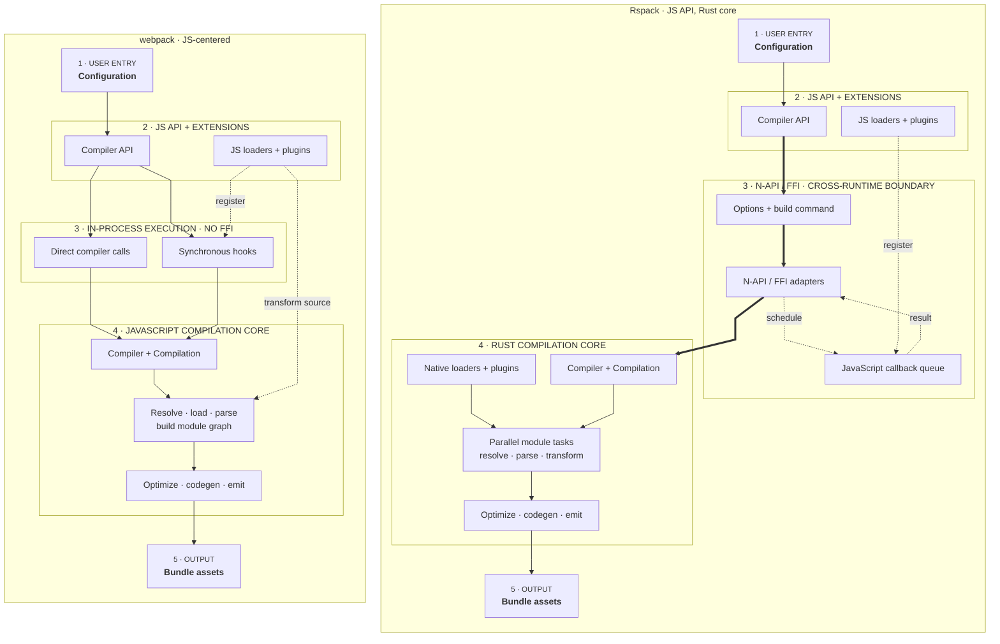
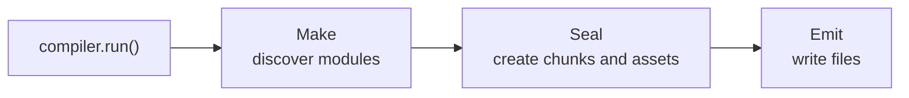

## Where would you begin?

Feopack started as a learning project.

:::commit-trail{title="Implementation trail · 4 commits"}
- [`2921d8c`](https://github.com/atom-universe/feopack/commit/2921d8c3aff9c9b36bda098f80a5079e1fec3e64) — establish the JavaScript wrapper
- [`d356247`](https://github.com/atom-universe/feopack/commit/d356247a5c145f2c8449b54f6305ce2495649f81) — add the native binding boundary
- [`3dada0f`](https://github.com/atom-universe/feopack/commit/3dada0f8f7e7b9285ea42e3114f12fc172ffaec1) — add the CLI and first playground case
- [`0f18045`](https://github.com/atom-universe/feopack/commit/0f180452e1e4f9983c9df94d142cd0407ea355b2) — introduce `Compiler` and per-build `Compilation` state
:::

Not because the JavaScript ecosystem needed another production bundler. It definitely did not wake up one morning asking for my tiny Rust experiment. I built it because I wanted to understand what modern bundlers like Rspack are doing under the surface.

Rspack's performance story is more interesting than “Rust is faster than JavaScript.” It moves much of the compilation work into Rust, uses a highly parallelized architecture, and keeps a webpack-compatible JavaScript surface where ecosystem code can still participate. The boundary matters because every trip back to JavaScript can introduce conversion, scheduling, and serial execution costs. Rspack's own [introduction](https://www.rspack.dev/guide/start/introduction) and [JavaScript API architecture](https://www.rspack.dev/api/javascript-api/architecture) describe that tradeoff in more detail.

That raises a useful design question. If you wanted to understand such a bundler by rebuilding a tiny version, where would you begin?

The Rust compiler core sounds like the obvious answer. I began somewhere less heroic: the JavaScript API.


Rebuilding webpack's behavior in a native implementation is not merely a translation exercise. Compatibility includes configuration, loaders, plugins, runtime semantics, and years of assumptions embedded in real projects. Rspack took on that inheritance while changing the engine underneath it.

Compatibility is not free. It keeps migration practical, but it also gives the new architecture a large behavioral surface to preserve. That was exactly what made it interesting to me. It suggested that there might still be room to rethink a few pieces and, maybe someday, take part in building something in that direction.

This first part follows the order in which Feopack's shell grew: JavaScript API, native binding, playground, and compilation lifecycle. The next part will follow the data itself, from source files to a generated bundle.

> BTW, the name Feopack is part of the joke. Rust can mean iron oxide, and FeO is also an iron oxide, just not the fully rusted one. So Feopack is a small, not-fully-rusted, Rspack-like experiment.

## 1. Starting from the JavaScript wrapper

The first meaningful layer was not Rust. It was the JavaScript-facing API, established in [`2921d8c`](https://github.com/atom-universe/feopack/commit/2921d8c3aff9c9b36bda098f80a5079e1fec3e64).

That might sound strange for a Rust-based bundler, but most users do not interact with a compiler core directly. They interact with a function, a config file, a CLI command, and a `Compiler` object.

So before worrying about module graphs and chunk graphs, I wanted the JavaScript-to-native handoff to feel boring in the best possible way.

In Feopack, the public API begins with something like this:

```ts
import feopack from "feopack";

const compiler = feopack({
  context: process.cwd(),
  entry: "./src/index.js",
  output: {
    path: "./dist",
    filename: "main.js",
  },
});

await compiler.run();
```

Nothing fancy, which is exactly the point. Internally, the call creates a JavaScript `Compiler`. The wrapper owns the user-facing API shape; the Rust side will eventually own the compilation work.

There is a useful test hidden in this design. If I replaced the unfinished core later, would user code need to change? If the answer were yes, the wrapper would not be much of a boundary.

But a friendly JavaScript API alone cannot fulfill its promise. Calling `run()` still needs to reach native code.

## 2. Making the boundary explicit with NAPI

What is the smallest bridge that can turn a JavaScript method call into Rust-owned work?

`napi-rs` handles much of the mechanical work, but it does not decide what crosses the boundary or who owns it. Those are architectural questions.

> **Commit [`d356247`](https://github.com/atom-universe/feopack/commit/d356247a5c145f2c8449b54f6305ce2495649f81) — Add the binding-layer skeleton**
>
> Convert JavaScript-facing options into Rust-owned compiler state and expose a native build method.

The TypeScript wrapper lazily creates a native compiler from `@feopack/binding`. On the Rust side, that native class receives `RawOptions`, converts them into internal compilation options, and exposes a `build()` method.

The boundary becomes easier to understand when webpack and Rspack are placed in the same picture. This is deliberately a simplified comparison: webpack can delegate work to workers or native tools, and Rspack still runs compatible JavaScript extensions. The important difference is where the main compilation work normally lives.



At first glance, the Rspack side appears to be the webpack side with a faster language inserted underneath it. That explanation is attractive, incomplete, and worth distrusting. If Rust were the whole answer, why could a Rspack build ever lose its advantage?

### Why Rspack is usually faster

The largest gains appear when the expensive work stays on the Rust side. Parsing, transforming, graph processing, optimization, code generation, and built-in loaders can use native implementations and spread independent work across CPU cores. Large module graphs provide enough work for that parallelism to matter.

Native built-ins also avoid an important tax. A JavaScript loader or plugin must be scheduled back into the JavaScript environment, but a Rust implementation can continue inside the native pipeline. Rspack's [introduction](https://www.rspack.dev/guide/start/introduction) describes the combination of Rust, parallelism, and built-in features; its [performance guide](https://www.rspack.dev/guide/diagnostics/profile) recommends native SWC, Lightning CSS, and built-in plugins when JavaScript equivalents become bottlenecks.

This is why the diagram draws the Rust task area as more than a replacement box. The advantage comes from changing where work runs, how much of it can overlap, and how often the build must leave the native pipeline.

### Where the advantage can shrink—or reverse

The dotted callback path is the catch. JavaScript extensions cannot execute directly on Rspack's Rust worker threads. Their callbacks are queued into the JavaScript environment and run one by one. When a Rust task needs the result, it waits. Rspack's [JavaScript API architecture](https://www.rspack.dev/api/javascript-api/architecture) calls these callbacks serial execution points and notes that frequent or expensive JavaScript loaders can pull a parallel build closer to serial execution.

That produces a few cases where the expected speedup becomes smaller:

- A pipeline dominated by Babel, PostCSS, Terser, or JavaScript plugins may spend more time in the same JavaScript work than in either bundler's core.
- A plugin that crosses the boundary for every module—or repeatedly reads native-backed objects from JavaScript—adds scheduling and conversion costs around that work.
- A very small build may not contain enough parallel work to amortize fixed costs such as native compiler creation, option conversion, and callback setup.
- An I/O-bound build on slow storage may gain little from adding more worker threads; excessive concurrency can even add contention.

The third point is an architectural inference, not a promise that webpack wins below some universal project size. There is no useful module-count threshold. Configuration, cache state, plugins, loaders, storage, and build mode can matter more than the number of files.

So “Rspack is faster than webpack” is a good expectation for many substantial webpack-shaped applications, not a law of nature. A more useful prediction asks where the work runs:

- **Mostly native, with enough independent tasks:** Rspack has more room to pull ahead.
- **Mostly JavaScript, with less parallel work:** the advantage narrows, and a particular webpack build may even win.

The binding is a platform-specific native library loaded by Node.js. It is the small door JavaScript uses to knock on Rust's very serious office.

Before reading the three cases below, consider the ownership question yourself: when a value crosses this boundary, should Rust borrow JavaScript behavior, should JavaScript hold native state, or should one side simply copy the data?

First, JavaScript can hold a handle to Rust state. That is the normal `Compiler` story: Rust owns the real compiler instance, while JavaScript receives an object that can call methods such as `build()`. JavaScript is not rebuilding the compiler; it is holding the remote control.

Second, Rust can hold a reference back to JavaScript-owned behavior. This becomes necessary when an object contains callbacks, factories, loaders, or plugin code. Rust should not try to interpret that JavaScript. It keeps a safe reference and schedules the function in the JavaScript environment when needed. Rspack uses types such as `ThreadsafeJsValueRef` and threadsafe functions for this kind of traffic.

Third, sometimes the best answer is no shared reference at all. Configuration is a good example. If an option is stable for one build, the binding can convert the incoming JavaScript object into Rust-owned data.

A JavaScript option might accept several shapes while Rust wants an explicit enum:

```rust
let pathinfo = match value.pathinfo {
  Either::A(value) => PathInfo::Bool(value),
  Either::B(value) => PathInfo::String(value),
};
```

Some options may be either plain data or a JavaScript callback, so the Rust type must describe that honestly:

```rust
pub struct JsFilename<F = ThreadsafeFunction<(JsPathData, Option<JsAssetInfo>), String>>(
  Either<String, F>,
);
```

This made the binding layer feel less like glue and more like a customs office. Values arrive from JavaScript with flexible passports, and Rust politely asks everyone to fill out the correct forms before entering the compiler core.

> I also considered passing a Node-side file system or resolver factory into Rust.
>
> Feopack did not implement those ideas at this stage. They were reminders that a cross-language boundary is not finished merely because configuration can travel in one direction.
>
> I also started another library named `@rush-fs/core` as a small experiment in that direction. Hopefully I will eventually find enough time outside work to finish all these tiny side quests.

## 3. Making the compiler confess

After the wrapper and binding skeleton existed, I needed a way to learn whether they were telling the truth. A bundler without runnable examples is mostly just a collection of confident claims.

On the one hand, I believe everyone loves TDD because it gives us a repeatable way to check whether the logic works.

On the other hand, I am sometimes too lazy to invent good cases from scratch. A tragic flaw, I know.

So in [`3dada0f`](https://github.com/atom-universe/feopack/commit/3dada0f8f7e7b9285ea42e3114f12fc172ffaec1), I added a CLI and a small playground. A case could be triggered with a command such as `pnpm test chunk/basic`, after which I could inspect the generated files instead of trusting the compiler's type names until it confessed what it was doing.

> To be honest, I no longer remember exactly which upstream cases inspired these fixtures. I later searched the Rspack and webpack repositories again and could not trace them confidently.
>
> The fixtures are therefore best treated as small Feopack examples, not as copies of a particular upstream test suite.

The playground did more than provide regression tests. It changed how I could think. Instead of asking whether a data structure looked plausible, I could ask what code entered the compiler, what asset came out, and where the two stopped agreeing.

With that in place, I could finally start building the actual compiler pipeline.

## 4. Where should one build's state live?

Should one long-lived compiler own every piece of mutable state forever, or should each build receive a fresh working state?

The core introduced a `Compiler` and a `Compilation`.

> **Commit [`0f18045`](https://github.com/atom-universe/feopack/commit/0f180452e1e4f9983c9df94d142cd0407ea355b2) — Add the basic compilation core**
>
> Keep long-lived configuration on `Compiler` and create fresh `Compilation` state for a build.

- `Compiler` owns the high-level build process and configuration that survives across builds.
- `Compilation` owns the state of one build: options, module graph, chunk graph, and generated assets. I think of it as the working memory for a single build.

In this early implementation, the build path used three convenient labels: make, seal, and emit. They were inspired by webpack and Rspack terminology, but they were not a claim to reproduce either compiler's complete lifecycle.



The distinction mattered more than the exact names:

- `Make` is where modules are discovered and the module graph grows.
- `Seal` is where that graph becomes chunks and generated assets.
- `Emit` writes the final files to disk.

Many real transitions, hooks, failure paths, and rebuild concerns were absent. That was intentional. I wanted to keep one successful build visible without pretending the hook system or watch lifecycle existed yet.

> Yes, the hook system was unfinished. But someday, maybe I would get to it. Probably right after finishing all the other “small” ideas.

At this point, Feopack had an entrance, a cross-language contract, a runnable case, and a place to store one build's state. It still did not truly bundle anything.

That is the boundary between this article and the next one. The shell of a compiler can look convincing while its `Compilation` remains nearly empty. In [the next part](/posts/feopack-from-source-to-bundle/), we will ask the less polite question: how does a source file become a module graph, a chunk, and finally executable output?
