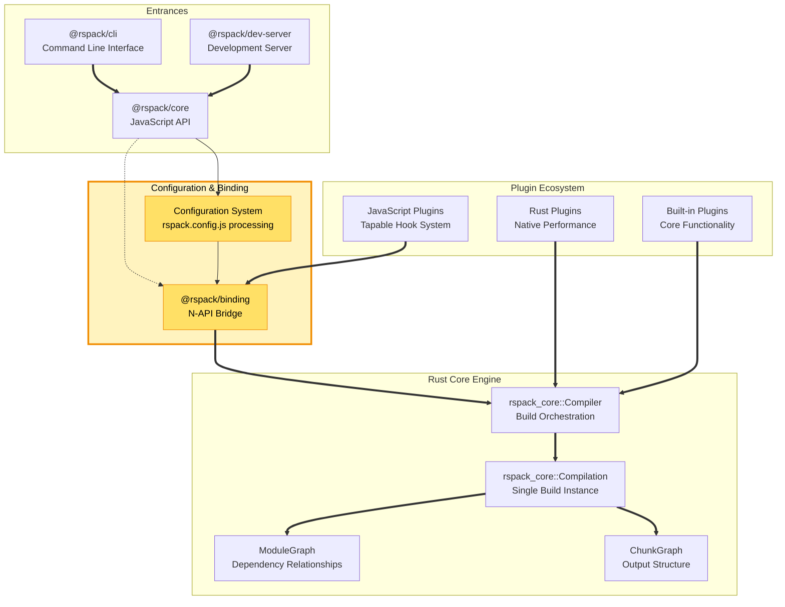
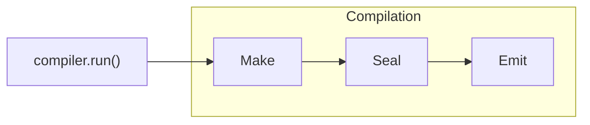
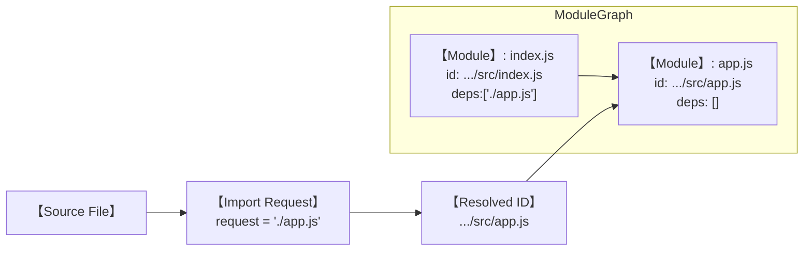
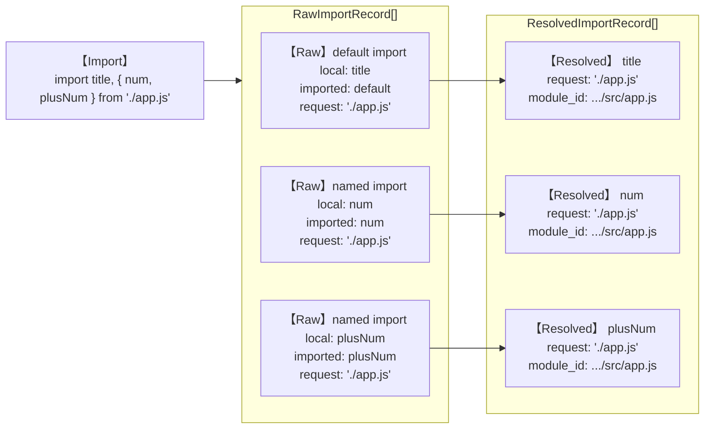
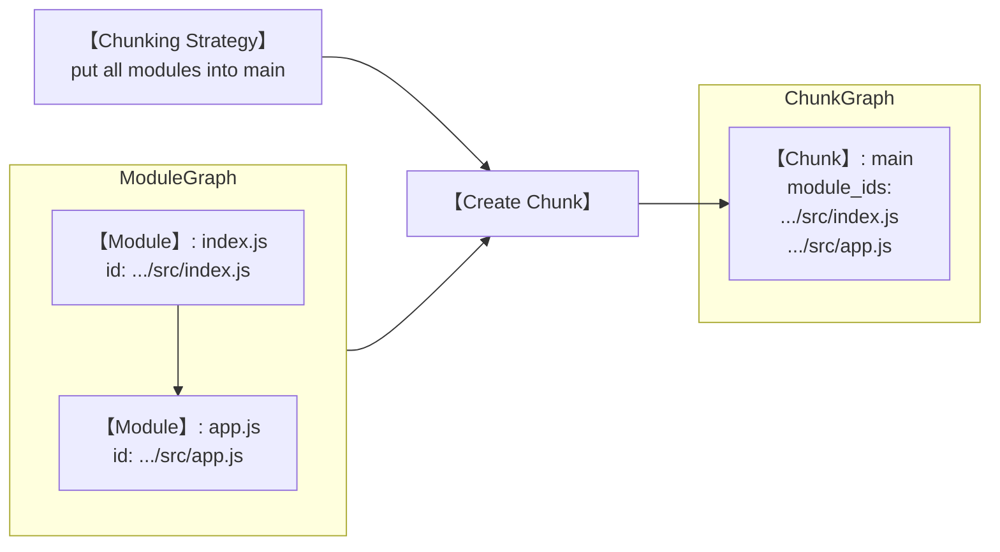
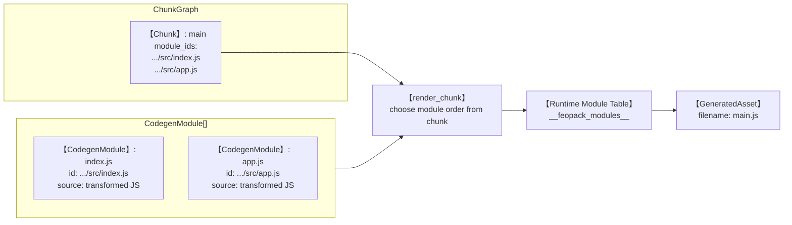
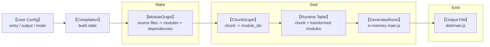

> Draft note: this is an early version of the post. I will likely add more concrete code snippets, screenshots, benchmark notes, and implementation details later.

## Why did I build it?

feopack started as a learning project.

Not because the JavaScript ecosystem needed another production bundler. It definitely did not wake up one morning asking for my tiny Rust experiment. I built it because I wanted to understand what modern bundlers like Rspack are doing under the surface.

Rspack is much faster than webpack because it moves many heavy tasks into the native layer. This helps avoid the bottleneck of JavaScript's single-threaded execution model and reduces the overhead of communication inside the build pipeline.

```mermaid
flowchart LR
  Entry["【Entry Points】<br/>main.js / another entry"]

  subgraph MAKE["Make"]
    direction TB
    Queue["【Module Worker Queue】<br/>parallel module jobs"]
    Build["【Build & Analyze】<br/>resolve deps / run loaders / parse AST"]
    ModuleGraph["【ModuleGraph】<br/>modules + dependency edges"]
    Queue --> Build
    Build -- "discovered deps" --> Queue
    Build --> ModuleGraph
  end

  subgraph SEAL["Seal"]
    direction TB
    Optimize["【Optimization Analysis】<br/>used exports / side effects"]
    ChunkGraph["【ChunkGraph】<br/>code splitting + chunk groups"]
    Ids["【ID Generation】<br/>module ids + chunk ids"]
    Codegen["【Code Generation】<br/>tree shaking + final module code"]
    Runtime["【Runtime Modules】<br/>chunk loading / helpers"]
    Assets["【Chunk Assets】<br/>runtime chunks + normal chunks"]
    Optimize --> ChunkGraph
    ChunkGraph --> Ids
    Ids --> Codegen
    Codegen --> Assets
    Runtime --> Assets
  end

  subgraph EMIT["Emit"]
    direction TB
    Output["【Emit Assets】<br/>write files to output"]
  end

  Entry --> Queue
  ModuleGraph --> Optimize
  ChunkGraph --> Runtime
  Assets --> Output
```



I guess someone once tried to rebuild the whole webpack ecosystem in C++, then do something Rspack-like, and got lost somewhere halfway through the maze. Maybe webpack is simply too huge, and too deeply married to `Tapable`, to be casually rebuilt from scratch.

And somehow, Rspack actually did it.

Of course, it also had to carry a lot of luggage from the webpack era. Compatibility is not free, and when you inherit that much history, perfect performance is probably not included in the box.

But that was exactly what made it interesting to me. It suggested that there might still be room to push things further, to rethink a few pieces, and maybe, someday, to take part in building something in that direction. That curiosity is basically why I built feopack.

Anyway, back to feopack itself. Let's see what I actually did.

This post follows the order in which the project grew. It is less of a complete tutorial and more of a development journal: what I implemented, what I learned, and where the complexity started to show up and politely ruin my afternoon.

> BTW, the name feopack is part of the joke. Rust can mean iron oxide, and FeO is also an iron oxide, just not the fully rusted one. So feopack is a small, not-fully-rusted, Rspack-like experiment.


## 1. Starting from the JavaScript Wrapper

The first meaningful layer was not Rust. It was the JavaScript-facing API.

That might sound strange for a Rust-based bundler, but it makes sense. Most users do not interact with the compiler core directly. They interact with a function, a config file, a CLI command, and a `Compiler` object.


So before worrying about module graphs and chunk graphs, I needed to make this JavaScript-to-native handoff feel boring in the best possible way.

In feopack, the public API begins with something like this. Nothing fancy, which is exactly the point:

```ts
import feopack from "feopack";

const compiler = feopack({
  context: process.cwd(),
  entry: "./src/index.js",
  output: {
    path: "./dist",
    filename: "main.js",
  },
});

compiler.run();
```

Internally, this creates a `Compiler` instance. The TypeScript wrapper owns the user-facing shape of the API, while the Rust side owns the actual compilation work.

But a friendly JavaScript API alone is not enough. It still needs a bridge into the native layer, which brings us to the binding.

## 2. Making the Boundary Explicit with NAPI

Luckily, `napi-rs` does most of the heavy lifting needed to build that bridge.

The TypeScript wrapper only needs to lazily create a native `Rspack` instance from `@feopack/binding`. On the Rust side, that native class receives `RawOptions`, converts them into internal compilation options, and exposes an async `build()` method.

In the bigger Rspack-shaped picture, this is the highlighted `Configuration & Binding` slice: the place where user-facing configuration turns into something the native compiler can actually work with.



The so-called binding is essentially a platform-specific native library loaded from Node.js. It is the small door JavaScript uses to knock on Rust's very serious office.

This boundary forced me to make the data structures explicit. JavaScript objects can be flexible and loose. Rust compiler options cannot be quite that casual. The binding layer becomes the place where the two worlds agree on a contract, preferably before either side starts throwing confusing errors at the other.

While reading Rspack's binding layer, I found it useful to think about three kinds of cross-language traffic.

First, JavaScript can hold a reference to Rust state. This is the normal `Compiler` story: Rust owns the real compiler instance, while JavaScript receives an object that can call methods like `build()`. In a webpack-compatible world, this also matters because JavaScript plugins may need to observe or interact with runtime compiler data. JavaScript is not rebuilding the compiler; it is holding the remote control.

Second, Rust can hold a reference back to JavaScript. This is needed when an object passed from JS contains callbacks, factories, or other JS-owned behavior. Rust should not try to “interpret” that JavaScript by itself. Instead, it keeps a safe reference to the JS value and asks the JS runtime to execute it when needed. In Rspack, types like `ThreadsafeJsValueRef` and `ThreadsafeFunction` exist for this kind of situation: Rust can call back into JS without pretending V8 is just another Rust crate.

Third, sometimes the best answer is no reference at all: just copy the data. Configuration is a good example. A config object is usually expected to be stable during a build, so the binding layer can convert the incoming JS object into Rust-side options. This is where `RawOptions` becomes `CompilerOptions`, and the real work is less glamorous than it sounds: flatten JavaScript's dynamic shapes into Rust's stricter types.

For example, a JavaScript option might allow multiple shapes, while Rust wants an explicit enum:

```rust
let pathinfo = match value.pathinfo {
  Either::A(value) => PathInfo::Bool(value),
  Either::B(value) => PathInfo::String(value),
};
```

Some options can even be either a plain value or a JavaScript callback. The Rust type has to describe that honestly:

```rust
pub struct JsFilename<F = ThreadsafeFunction<(JsPathData, Option<JsAssetInfo>), String>>(
  Either<String, F>,
);
```

That made the binding layer feel less like glue code and more like a customs office. Objects arrive from JavaScript with flexible passports, and Rust politely asks everyone to fill out the correct forms before entering the compiler core.

> I also had a few ideas along the way, such as passing a Node-side file system or resolver factory into Rust.
> 
> I did not implement them in feopack at this stage, but they were useful reminders of where the boundary could grow later.
>
> I also started another library project named `@rush-fs/core`, which is one small experiment in that direction. Hopefully, I will eventually find enough time outside work to finish all these tiny side quests.


After the wrapper and binding skeleton existed, I added a CLI and a small playground. A bundler without a way to run examples is mostly just a collection of confident lies.

## 3. Adding a CLI and Playground to Show My Love for TDD

On the one hand, I believe everyone loves TDD, because it gives us a nice, repeatable way to check whether our logic actually works.

On the other hand, there is one tiny problem: I am sometimes too lazy to come up with good test cases from scratch. A tragic flaw, I know.

So I borrowed some cases from Rspack's source code, made a few small changes, and wired them up so they could be triggered with commands like `pnpm test chunk/basic`. The goal was simple: run a case, generate assets, and stare at the output until the bundler confessed what it was doing.

> To be honest, I no longer remember exactly where I found those cases. I later checked the Rspack and Webpack repositories again and somehow could not find them. Maybe they moved. Maybe I imagined them. 
> 
> Either way, the playground survived, which is what really matters.


With that in place, I could finally start building the actual compiler pipeline.

## 4. Building the Compilation Lifecycle

As mentioned earlier, the core introduced a `Compiler` and a `Compilation`.

- `Compiler` owns the high-level build process.
- `Compilation` owns the state of one build: options, module graph, chunk graph, and generated assets. I think of it as the working memory for a single build.

In feopack, the outer calls are mostly wrappers around the real bundler core. The core lifecycle follows the familiar three-step shape: make, seal, and emit.



This is close to how many bundlers organize their work. The names may vary, and production bundlers have far more hooks and intermediate states, but the main rhythm is usually the same.

- `Make` is where modules are discovered and the module graph starts to grow.
- `Seal` is where that graph becomes chunks and generated assets.
- `Emit` writes the final files to disk.

Some stages, such as `CompileDone` and `MakeDone`, were simplified away. That was intentional. I wanted to keep the lifecycle visible without pretending the hook system existed yet.

> Yes, the hook system is still unfinished. But someday, maybe I will get to it. Probably right after finishing all the other “small” ideas.

## 5. From Source Files to a Module Graph

From this point on, the project became a series of data-structure transformations.

A bundler starts with files on disk, but files are not a very useful shape for a compiler. The first job of `make()` is to turn source files into a graph: each module becomes a node, and each import becomes an edge to another module.

In feopack, the simplified `Module` looked like this:

```rust
pub struct Module {
  pub id: String,
  pub dependencies: Vec<String>,
}
```

Storing dependency strings directly is not ideal. A more serious bundler would usually store references, dependency objects, or richer edges, especially if it wants incremental builds. But for this stage, the goal was to make the shape visible: “this module depends on those modules.”

The rough transformation was:

Take the `chunk/basic` playground case as an example. The entry file is almost embarrassingly small, which is exactly why it is useful:

```js
// src/index.js
import title, { num, plusNum } from "./app.js";

title("Hello FeOPack");
console.log(num);
plusNum();
console.log(num);
```



The `make()` phase uses `SWC` to parse each module and read its import declarations. 

A small `VecDeque` queue then keeps track of which resolved files still need to be processed. In real Rspack, this would involve `EntryDependency`, a `ModuleFactory`, and a task loop for parallel scheduling. feopack keeps only the minimal version: parse with SWC, resolve the discovered imports, push the next module paths into the queue, and repeat.

```rust
queue.push_back(entry_path);

while let Some(module_path) = queue.pop_front() {
  if visited.contains(&module_path) {
    continue;
  }

  visited.insert(module_path.clone());
  // read source, parse with SWC, resolve imports, queue dependencies
}
```

Module identity is not a detail here. In the playground case, `./app.js` is only the request written in `src/index.js`; the compiler still needs a stable internal ID, usually a normalized resolved path like `.../src/app.js`.

Without that normalization, two equivalent paths can accidentally become two different modules, and the graph stops being a graph of the program. 

It becomes a graph of spelling choices.

## 6. From JavaScript Syntax to Import Records

The module graph needs dependencies, but JavaScript source code does not hand them over as a neat list. It gives you syntax.

That is where SWC enters the design. Writing a JavaScript parser would be a different project. For a bundler, the more relevant question is how parser output becomes compiler state. SWC provides the AST; feopack decides which parts of that AST become import records, graph edges, and eventually runtime code.

Take the same line from `src/index.js`:

```js
import title, { num, plusNum } from "./app.js";
```

For this import line, the important conversion is not the full AST shape. The useful data flow is how this declaration becomes records the compiler can use:



The raw import record keeps what the source code says:

```rust
pub struct RawImportRecord {
  pub local: String,
  pub imported: String,
  pub request: String,
}
```

Then `resolve_imports()` turns that into a resolved record by adding the real module ID:

```rust
pub struct ResolvedImportRecord {
  pub local: String,
  pub imported: String,
  pub request: String,
  pub module_id: String,
}
```

That extra `module_id` is where syntax becomes compiler state. In the diagram, `request` keeps the original source-level value, `./app.js`, while `module_id` points to the resolved module, `.../src/app.js`. Keeping both fields avoids mixing two different concepts: the user's module request and the compiler's canonical module identity.

The imports are also stored in a `Vec`, not a map. The reason is not performance; it is semantics. Import declarations have source order, and source order can matter once transformations, side effects, or generated helper statements enter the picture. A map would make lookup convenient, but it would quietly discard ordering information. That is exactly the kind of “small simplification” that later becomes a semantic bug.

## 7. From Module Graph to Chunk Graph

Once the module graph existed, the next question was: how should these modules be packaged?

That is the job of the chunk graph. A module graph describes relationships in the source program. A chunk graph describes the runtime packaging plan. They are related, but they answer different questions.

In feopack, the chunk data structure was intentionally tiny:

```rust
pub struct Chunk {
  pub id: String,
  pub module_ids: Vec<String>,
}

pub struct ChunkGraph {
  pub chunks: Vec<Chunk>,
}
```

The transformation is deliberately simple:



In a real bundler, this step would involve grouping strategies. 

But I didn't complete it, the current version puts every module into one chunk. That means no advanced code splitting, no async chunk loading, no CSS ordering, and no optimization pass.

> hope that one day I will finish it

```rust
let chunk = Chunk {
  id: "main".to_string(),
  module_ids,
};

self.chunk_graph.chunks.push(chunk);
```

Even in this simplified version, `ChunkGraph` has a different responsibility from `ModuleGraph`. `ModuleGraph` is about program structure: who imports whom. `ChunkGraph` is about delivery: what files will the runtime load, and which modules live inside them.

So the data shape moved one step forward:

```text
source files -> modules -> module graph -> chunk graph
```

The bundler was still not “smart,” but the representation had moved from source units to runtime units.

## 8. From Codegen Modules to Generated Assets

The last transformation in this part is where a chunk becomes an output asset.

The important detail is that a `Chunk` does not contain generated JavaScript yet. In this version, it only contains `module_ids`: the list of modules that should be rendered together. Code generation then walks those IDs, loads the corresponding module source, rewrites its import/export syntax, and stores the result as a temporary `CodegenModule`:

```rust
struct CodegenModule {
  id: String,
  source: String,
  imports: Vec<ResolvedImportRecord>,
}
```

This structure is a bridge between the compiler world and the runtime world. It no longer represents the original file exactly. It represents a module after its imports and exports have been rewritten into something the bundle runtime can execute.

During code generation, two pieces of compiler state meet: the chunk tells `render_chunk()` which modules belong to the output, and `CodegenModule[]` provides the transformed source for those modules.



The final asset structure is simple:

```rust
pub struct GeneratedAsset {
  pub filename: String,
  pub source: String,
}
```

The important part is that `render_chunk()` turns a list of `CodegenModule`s into a tiny module system:

```js
const __feopack_modules__ = {
  "entry.js": (__feopack_module__, __feopack_import__) => {
    // transformed module code
  },
};

const __feopack_cache__ = {};

function __feopack_import__(id) {
  if (__feopack_cache__[id]) {
    return __feopack_cache__[id].exports;
  }

  const __feopack_module__ = { exports: {} };
  __feopack_cache__[id] = __feopack_module__;
  __feopack_modules__[id](__feopack_module__, __feopack_import__);
  return __feopack_module__.exports;
}
```

The transition matters very much. 

Once imports and exports enter the picture, a bundle is not just concatenated JavaScript. It is a small module system pretending to be a file.

> This part gradually moved from a CommonJS-style idea toward something closer to ESM-style runtime behavior. 
> 
> At first, I built the CJS-style version based on my webpack experience, but it produced incorrect bundles in a few cases.
>
> So I started moving it toward an ESM-style runtime model, which fits modern module semantics better.

One rough edge remains in this implementation: it creates a fresh `SwcCompiler` inside chunk processing. That is not the most elegant architecture. A more mature version would think harder about compiler ownership, shared state, and concurrency boundaries. 

But for a small bundler, this tradeoff kept the pipeline explicit enough to reason about.

At this point, the chunk has stopped being only a packaging plan. It has become an in-memory `GeneratedAsset`, with a runtime table, transformed module functions, and an entry call. The later `emit_assets()` step is responsible for writing that asset to disk.

## 9. Where the Runtime Semantics Start to Bite

By the time `GeneratedAsset` exists, the main build path has already reached emit-ready output. What remains interesting is not another pipeline stage, but the semantic cost hidden inside code generation.

The pipeline sounds clean: source code becomes an AST, the AST becomes a transformed AST, and the transformed AST becomes JavaScript again. In practice, this is where earlier abstraction choices start to matter. The implementation has to decide how imports become runtime reads, how exports stay live, and how generated helpers fit into the module function.

There was also friction around SWC codegen APIs and ecosystem version compatibility. Emitting JavaScript from an AST required understanding `Emitter`, `JsWriter`, `SourceMap`, and how errors should be mapped back into feopack's own error type.

Import and export semantics were the real rabbit hole. feopack gradually added support for:

- default imports
- named imports
- exported variables
- exported functions
- named export declarations
- dynamic export definitions on the generated exports object

This required transforming import declarations into namespace objects and rewriting imported bindings. For example, a named import needs to become a property access on the imported module namespace. That is the role of the binding rewriter: find identifiers that came from imports and rewrite them to the generated namespace access.

The current implementation leaves many cases unsupported:

- namespace imports are not supported yet
- anonymous `export default function` is not supported
- `export ... from` re-exports are not supported
- destructuring export declarations are not supported
- many non-JavaScript assets are out of scope

These limitations are useful because they mark the actual boundary of the implementation. Every JavaScript syntax form expands the bundler's semantic surface. Supporting `import title, { num, plusNum } from "./app.js"` is not just parsing a string. It affects graph resolution, AST transformation, runtime export definition, and generated code behavior.

## 10. Putting the Build Path Together

The useful way to look at this milestone is not as a feature checklist, but as a sequence of data structures. Each step gives the next step a more precise shape to work with.



This complete path is the part feopack currently implements: configuration enters from JavaScript, Rust builds a `Compilation`, `make()` constructs the module graph, `seal()` groups modules into a chunk and generates an in-memory `GeneratedAsset`, and `emit_assets()` writes it to disk.

Of course, this is still far from a real bundler. The obvious missing pieces are a plugin system, a loader pipeline, CSS and asset modules, HMR, source maps, tree shaking, advanced chunk splitting, and much more complete ESM compatibility. If I continue working on feopack, these are probably the directions I will pick up one by one.

## 11. Why This Still Matters in the Agent Era

feopack is not production-ready, and it is not trying to be. That was never the point.

We are in a moment where the industry is full of new tools, new workflows, new model capabilities, and new reasons to feel behind. I pay attention to those things too. It would be strange not to. But the more noise there is, the more important it becomes to keep some independent technical judgment.

For me, that judgment cannot come only from reading announcements, watching demos, or collecting opinions from other people. It has to be grounded in the ability to take a system apart, rebuild a small version of it, and understand where the real complexity lives.

That is why writing feopack mattered. Not because the world needs another bundler, but because implementing even a small path through a bundler forces the abstractions to become concrete: config, binding, compilation, module graph, chunk graph, runtime table, asset, emit. After that, “bundler architecture” is no longer just a phrase. It has weight.

Writing about it is part of the same process. It is a way to leave evidence that I did not only skim the surface. I actually followed the data structures, hit the awkward edges, and formed my own understanding.

Or, to keep the original Chinese line that says this better than I can:

> 批五岳之图以为知山，不如樵夫之一足；谈沧溟之广以为知海，不如估客之一瞥；疏八珍之谱以为知味，不如庖丁之一啜。
> 及之而后知，履之而后艰，乌有不行而能知者乎？
