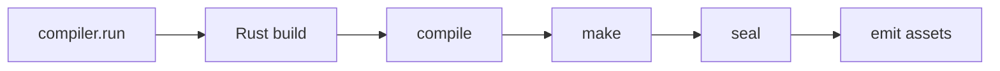
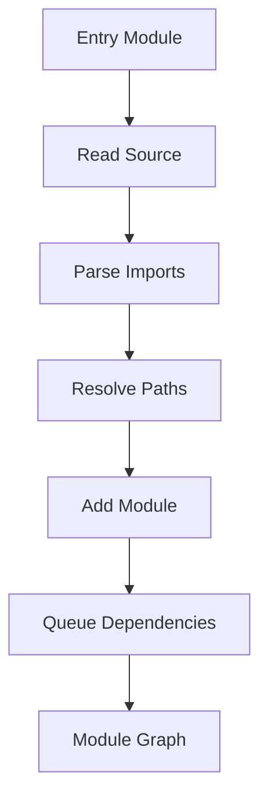
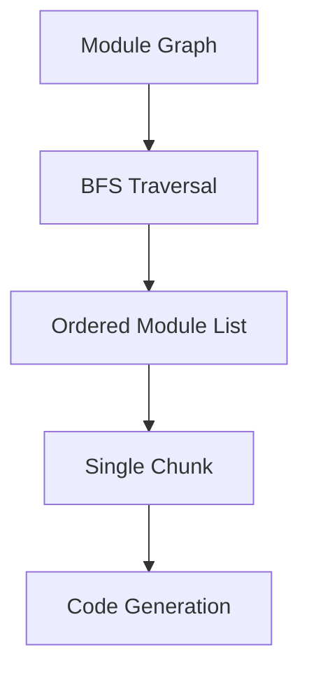

> Draft note: this is an early version of the post. I will likely add more concrete code snippets, screenshots, benchmark notes, and implementation details later.

# Why did I build it?

Feopack started as a learning project.


Not because the JavaScript ecosystem needed another production bundler. I built it because I wanted to understand what modern bundlers like Rspack are doing under the surface. 

As we all know, Rspack bring the  

The name is also part of the joke. Rust means iron oxide in a way, and FeO is also an oxide of iron, but not the fully rusted one. So FeOPack is a small, not-fully-rusted, Rspack-like experiment.

This post follows the order in which the project grew. It is less of a complete tutorial and more of a development journal: what I implemented, what I learned, and where the complexity started to appear.

## 1. Starting from the JavaScript Wrapper

The first meaningful layer was not Rust. It was the JavaScript-facing API.

That might sound strange for a Rust-based bundler, but it makes sense. Most users do not interact with the compiler core directly. They interact with a function, a config file, a CLI command, and a `Compiler` object.

In FeOPack, the public API begins with something like this:

```ts
import feopack from "feopack";

const compiler = feopack({
  context: process.cwd(),
  entry: "./src/index.js",
  output: {
    path: "./dist",
    filename: "main.js",
  },
});

compiler.run();
```

Internally, this creates a `Compiler` instance. The TypeScript wrapper owns the user-facing shape of the API, while the Rust side owns the actual compilation work.

This was my first lesson: even if the heavy lifting happens in Rust, the ergonomics of a bundler are still mostly designed at the JavaScript layer.

The wrapper also introduced a config adapter. At first, this looks boring. It just converts user options into the raw format expected by the native binding. But this layer is important because it becomes the border between a friendly JavaScript API and a stricter compiler core.

## 2. Making the Boundary Explicit with NAPI

The next step was adding the binding layer with `napi-rs`.

The TypeScript wrapper lazily creates a native `Rspack` instance from `@feopack/binding`. On the Rust side, this native class receives `RawOptions`, converts them into internal compilation options, and exposes an async `build()` method.

The architecture at this stage looked roughly like this:


This boundary forced me to make data structures explicit. JavaScript objects can be flexible and loose. Rust compiler options cannot be quite as casual. The binding layer becomes the place where the two worlds agree on a contract.

There were also some commented-out ideas in the wrapper, such as passing a Node-side file system or resolver factory into Rust. I did not implement them at this stage, but the comments were useful reminders: a real bundler is not just a native compiler. It also has to cooperate with the JavaScript toolchain around it.

For this project, I kept the boundary small on purpose. The wrapper passes options. Rust builds. JavaScript calls `run()`. That was enough to move forward.

## 3. Adding a CLI and Playground Before the Compiler Was Ready

After the wrapper and binding skeleton existed, I added a CLI and a playground case.

The CLI was intentionally simple. It parses a config file path, loads the config, creates a compiler, and runs it. It was not fancy, but it gave the project a real way to execute the compiler from the command line.

The playground was more important than it looked.

At first, I had a small test folder. Later, I moved toward a playground structure inspired by Rspack-style test cases. Some cases were copied or adapted, and not all of them were supported. That was fine. The point was not to have perfect test coverage from day one. The point was to have real input files and real output files to inspect.

In other words, the playground acted as a compass.

It told me what the compiler needed to support next. If a basic case imported another module, then module resolution became necessary. If a case used named imports, then import/export transformation became necessary. The tests were not just tests; they were small product requirements.

This was the second big lesson: for a learning compiler, a rough but runnable feedback loop is more useful than a beautiful architecture diagram that cannot produce output.

## 4. Building the Compilation Lifecycle

Once the outer layers were in place, I started building the Rust compiler core.

The core introduced a `Compiler` and a `Compilation`. The `Compiler` owns the high-level build process. A `Compilation` owns the state of one build: options, module graph, chunk graph, and generated assets.

The lifecycle became:



The names are inspired by how real bundlers structure their work. Even though many phases were incomplete, having names for them helped a lot.

`make()` is where modules are discovered. `seal()` is where the module graph becomes chunks and generated assets. `emit_assets()` writes the final files to disk.

There were comments like `compile_done()` and `make_done()` being skipped. That was intentional. I wanted to keep the lifecycle visible without pretending the hook system existed yet.

This was another useful lesson: a mini bundler can skip many features, but it should still preserve the shape of the real pipeline. The shape teaches you where future complexity would live.

## 5. Discovering That a Bundler Is a Module Graph Builder First

Before writing a bundle, FeOPack needed to understand the program.

That meant starting from the entry module, reading the source file, collecting its imports, resolving dependency paths, and repeating the process for each dependency.

The result was a `ModuleGraph`.



This stage made me appreciate how central module identity is. A module needs a stable ID. Dependencies need to point to the correct resolved module. Relative paths like `./app.js` need to become normalized paths so that the compiler does not accidentally treat equivalent paths as different modules.

At this point, the bundler was not doing much code generation yet. But it had learned how to walk through a program.

That was the key shift in my mental model: a bundler is a graph builder before it is a code printer.

## 6. Parsing Source into AST with SWC

I used SWC for parsing JavaScript.

Manually parsing JavaScript would have been the wrong problem to solve. The goal was to learn bundler architecture, not to write a parser. SWC gave FeOPack a real AST and made it possible to focus on imports, exports, and transformations.

The SWC layer started with a few responsibilities:

- parse a source file into an AST
- collect import declarations
- later, transform module syntax into runtime-compatible code
- emit the transformed AST back into JavaScript

Even with a mature parser, limitations appeared immediately. FeOPack only focused on module-style JavaScript. Script mode was explicitly rejected. This was not because supporting script mode is impossible, but because every supported mode increases the semantic surface area.

This became a recurring pattern in the project: choose a small subset, make it work, then use the pain points to understand what real bundlers have to handle.

## 7. From Module Graph to Chunk Graph

After the module graph existed, the next step was turning it into a chunk graph.

In this version of FeOPack, the chunk model is deliberately simple: put all reachable modules into one chunk. The traversal uses BFS to walk from the entry through the module graph.



This is obviously far from production-level chunking. There is no advanced code splitting, no async chunk loading, no CSS chunk ordering, and no optimization pass.

But even this simple version taught me why a chunk graph exists. A module graph describes relationships between source modules. A chunk graph describes how those modules will be packaged for runtime.

Those are related, but they are not the same thing.

## 8. Rendering the First Bundle Runtime

The first working bundle was the most exciting milestone.

At this stage, FeOPack generated a module table and a small runtime. Each module became a function. The runtime provided a cache, an import function, export helpers, and finally executed the entry module.

Conceptually, the output looked like this:

```js
const __feopack_modules__ = {
  "entry.js": (__feopack_module__, __feopack_import__) => {
    // transformed module code
  },
};

const __feopack_cache__ = {};

function __feopack_import__(id) {
  if (__feopack_cache__[id]) {
    return __feopack_cache__[id].exports;
  }

  const __feopack_module__ = { exports: {} };
  __feopack_cache__[id] = __feopack_module__;
  __feopack_modules__[id](__feopack_module__, __feopack_import__);
  return __feopack_module__.exports;
}

__feopack_import__("entry.js");
```

This was when I really felt that a bundler does not merely transform source files. It also defines a runtime model.

The comments in the code mention that the implementation moved from a CommonJS-style idea toward something closer to ESM-style runtime behavior. That transition was important. Once imports and exports enter the picture, a bundle is not just concatenated JavaScript. It is a small module system.

## 9. Code Generation Is Where the AST Starts Fighting Back

The next stage was code generation.

The pipeline became source code to AST, AST to transformed AST, and transformed AST back to JavaScript.

In theory, that sounds clean. In practice, it was the stage where I started to feel the cost of AST manipulation.

Some comments in the code capture this honestly. I was not fully comfortable with some Rust ownership and cross-thread abstractions, so I chose a simpler approach: create or reuse compiler helpers in places where a more sophisticated architecture might avoid extra work.

Was it the most efficient design? Probably not.

Was it good enough for learning? Absolutely.

There was also friction around SWC codegen APIs and ecosystem version compatibility. Emitting JavaScript from an AST required understanding `Emitter`, `JsWriter`, `SourceMap`, and how errors should be mapped back into FeOPack's own error type.

This was one of the most practical lessons in the whole project: sometimes the hard part is not the concept. The hard part is making the concept survive real library APIs, real types, and real error handling.

## 10. Import and Export Semantics Are the Real Rabbit Hole

After the bundle runtime existed, the next complexity was import and export semantics.

FeOPack gradually added support for:

- default imports
- named imports
- exported variables
- exported functions
- named export declarations
- dynamic export definitions on the generated exports object

This required transforming import declarations into namespace objects and rewriting imported bindings.

For example, a named import needs to become a property access on the imported module namespace. That is the role of the binding rewriter: find identifiers that came from imports and rewrite them to the generated namespace access.

This part quickly showed how deep the rabbit hole goes.

There are many unsupported cases, and the code says so directly:

- namespace imports are not supported yet
- anonymous `export default function` is not supported
- `export ... from` re-exports are not supported
- destructuring export declarations are not supported
- many non-JavaScript assets are out of scope

These limitations are not embarrassing. They are the lesson.

Every JavaScript syntax form expands the bundler's semantic surface. Supporting `import { foo } from "./foo"` is not just parsing a string. It affects graph resolution, AST transformation, runtime export definition, and generated code behavior.

## 11. What This Stage of FeOPack Taught Me

This stage of FeOPack taught me more than I expected.

A bundler is a pipeline. The pieces are easier to understand when they are separated into wrapper, binding, compiler, compilation, graph construction, chunking, code generation, runtime, and emit.

A bundler is also a graph builder. The module graph is not an implementation detail. It is the structure that makes the rest of the build possible.

The runtime matters. Even a tiny bundle needs a module cache, an import function, and a consistent way to define exports.

The JS/Rust boundary matters. NAPI does not just connect two languages; it shapes the architecture. It decides what remains flexible in JavaScript and what becomes strict in Rust.

The test playground matters. Even imperfect cases are useful because they expose the next missing capability.

And finally, a learning project does not need to be complete to be valuable. In fact, keeping it incomplete made the important parts easier to see.

## 12. A Small Rusty Bundler, Not a Finished Bundler

FeOPack is not production-ready, and it is not trying to be.

It does not have a full plugin system, loader pipeline, CSS support, HMR, source maps, tree shaking, advanced chunk splitting, or complete ESM compatibility. Those are all large topics on their own.

For now, this project is a checkpoint: a small Rust-based bundler that goes from config to module graph, from module graph to chunk, and from chunk to a runnable bundle.

That was enough to make the architecture of modern bundlers feel much less magical.

If FeOPack grows further, that should probably be a separate post. This one is about the first milestone: building the smallest path that taught me how the pieces fit together.
