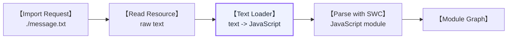
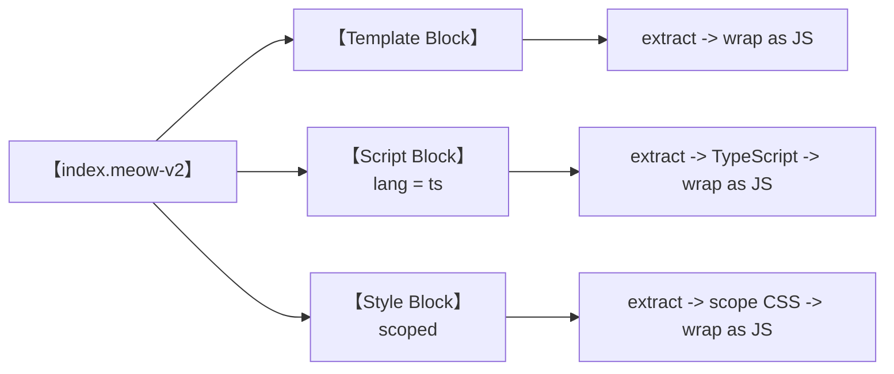
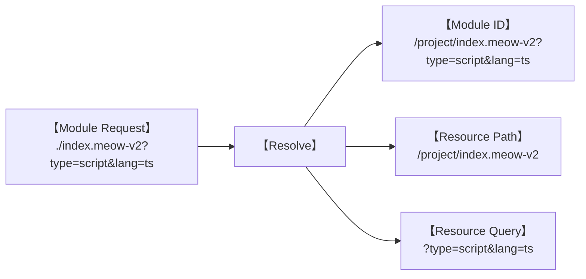
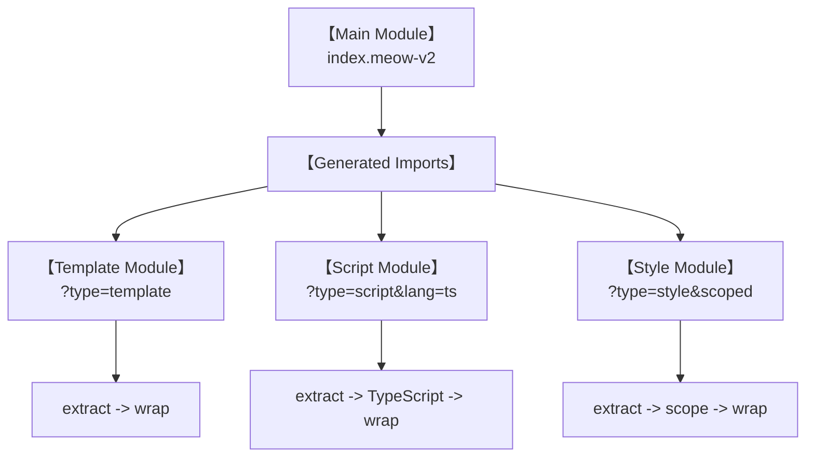
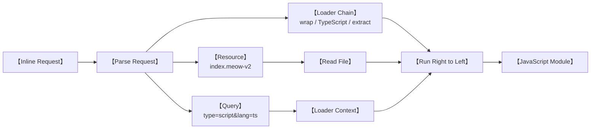

## Why did I come back to loaders?

In the previous post, Feopack learned the basic rhythm of a bundler: `make`, `seal`, and `emit`.

It could start from a JavaScript entry, follow its imports, build a module graph, turn that graph into a chunk, and finally emit a bundle. That was enough to prove the main path worked.

It also had one rather important limitation: every source file had to be JavaScript.

```js
import message from "./message.txt";
```

The request itself was easy to resolve. Feopack could find `message.txt` and read it from disk. Then it would confidently hand the text to SWC as JavaScript, and SWC would quite reasonably refuse to participate in this nonsense.

That is the problem a loader solves.

A loader takes source code in one form and turns it into a form the bundler already understands. In the smallest possible version, it is just a function:

```text
source -> loader -> transformed source
```

This post follows how that tiny idea grew inside Feopack. I did not begin by designing a complete loader system. I began with a text file, made the smallest thing that worked, and then let every new problem demand the next abstraction. This is also a convenient way to avoid inventing twelve beautiful interfaces for a feature that does not exist yet.

The story goes from Feopack's first Rust loader to its first virtual modules and inline loader requests. `pitch` and JavaScript loaders come later. They deserve their own collection of confusing afternoons.

## 1. Teaching Feopack One Small Trick

The first target was deliberately boring. I wanted this file:

```txt
Hello Feopack Loader
```

to become a JavaScript module that user code could import:

```js
import message from "./message.txt";

console.log(message);
```

The text loader only had to wrap the file content in an export:

```rust
pub fn text_loader(context: LoaderContext) -> Result<String, String> {
  Ok(format!(
    "const __feopack_text__ = {:?};\nexport {{ __feopack_text__ as default }};",
    context.source
  ))
}
```

Its output was ordinary JavaScript:

```js
const __feopack_text__ = "Hello Feopack Loader";
export { __feopack_text__ as default };
```

Once Feopack had that transformed source, the rest of the build did not need to know that the module began life as a text file. SWC could parse it, dependency analysis could inspect it, and code generation could bundle it like any other module.



This small case proved something important: loaders belong inside module building. They run after Feopack knows which resource it wants, but before the transformed source is parsed as a module.

The first implementation landed in `b34aaad` and became a working playground case in `c805801`.

## 2. One Function Is Not Yet a Loader System

Calling `text_loader()` directly would make the example work, but it would not give Feopack a loader system. The compiler still needed answers to three small questions:

1. Which files should use a loader?
2. Which function does a loader name refer to?
3. What information should the function receive?

The first version answered them with three equally small structures.

```rust
pub struct LoaderRule {
  pub test: String,
  pub used_loaders: Vec<String>,
}

pub struct LoaderContext {
  pub resource_path: PathBuf,
  pub source: String,
}

pub struct LoaderRegistry {
  loaders: HashMap<String, LoaderFn>,
  rules: Vec<LoaderRule>,
}
```

`LoaderRule` decided which resources matched. `LoaderRegistry` connected a loader name to a Rust function. `LoaderContext` carried the resource path and the current source through that function.

For the text case, Feopack registered one loader and one rule:

```rust
loader_registry.register_loader("text-loader".to_string(), text_loader);

loader_registry.add_rule(LoaderRule {
  test: ".txt".to_string(),
  used_loaders: vec!["text-loader".to_string()],
});
```

The word `used_loaders` is plural because loaders become more useful when they can be chained. If a rule contains:

```text
use: ["wrap-loader", "text-loader"]
```

then the source flows from right to left:

```text
raw text -> text-loader -> wrap-loader -> JavaScript module
```

Feopack followed the familiar webpack convention here. The order feels slightly backward when reading the configuration, but it means each loader consumes the result produced by the loader to its right.

The transformed source was then stored during `make()`. Later code generation consumed that stored result instead of reading the original file again and somehow forgetting that a loader had ever touched it. Forgetting your own build result is a surprisingly effective way to make a compiler look haunted.

At this point the model was still pleasantly small:

```text
resource path
  -> match a rule
  -> resolve a loader chain
  -> run the chain
  -> parse transformed source
  -> add a module to the graph
```

For `.txt`, this was already enough. So naturally, I immediately tried something that made it insufficient.

## 3. A Loader Can Be a Tiny Compiler

The next experiment was `meow-loader-v1`, a miniature and not particularly standards-compliant relative of `vue-loader`.

A `.meow-v1` file looked like this:

```html
<meow>🐱</meow>

<script>
console.log("mounted 🐱");
</script>
```

The loader extracted both blocks and generated a JavaScript function. The generated module was roughly shaped like this:

```js
const __feopack_meow_loader__ = () => {
  const element = document.getElementById("meow");
  element.innerHTML = "🐱";

  const script = document.createElement("script");
  script.textContent = 'console.log("mounted 🐱")';
  document.body.appendChild(script);
};

export { __feopack_meow_loader__ as default };
```

And user code could import it like a normal module:

```js
import meow from "./index.meow-v1";

meow();
```

This was more interesting than the text loader. A loader was no longer wrapping a string in `export default`. It was parsing a tiny file format, extracting meaningful sections, and generating executable JavaScript.

In other words, a loader could be a small compiler.

The first version worked, which was important. It also worked by doing everything itself, which was going to become less charming very quickly.

The template and script were both owned by one function. If I added a style block, the same function would need to understand CSS. If the script used TypeScript, the loader would need to transform TypeScript too. Every new block would add one more responsibility to the same increasingly ambitious piece of Rust.

Around the same time, Feopack gained a separate `typescript-loader`. That made the awkwardness easier to see. I already had a loader that knew how to transform TypeScript, but `meow-loader-v1` could not reuse it for the content inside `<script lang="ts">`.

Meow v1 was a tiny compiler hiding inside a single loader. The next version needed to take that compiler apart.

> Project checkpoint: `572b077` contains `meow-loader-v1`, and `51f6d2f` adds the TypeScript loader used by the next experiment.

## 4. One File, Several Jobs

The second Meow format added the shape I actually wanted to explore:

```html
<meow><span class="meow-title">🐱 V2</span></meow>

<script lang="ts">
interface Meow {
  name: string;
}

const cat: Meow = {
  name: "小苗",
};

console.log(cat);
</script>

<style scoped>
.meow-title {
  color: coral;
}
</style>
```

This was one file on disk, but its three blocks wanted three different transformation pipelines:



I could have kept adding branches to one large `meow_loader()` function. Side projects offer many opportunities to make a bad design technically work.

But the existing loader chain already knew how to compose small transformations. The real problem was that Feopack still assumed one physical file meant one module.

For Meow v2, one file needed to become several logical modules.

## 5. A Module Is Not Always a File

Until this point, a normalized file path was enough to identify a module:

```text
/project/src/index.js
```

Meow v2 needed several identities for the same resource:

```text
/project/src/index.meow-v2
/project/src/index.meow-v2?type=template
/project/src/index.meow-v2?type=script&lang=ts
/project/src/index.meow-v2?type=style&scoped
```

Only one file existed on disk. The query described which logical part of that file the current request wanted.

That meant Feopack could no longer use one `PathBuf` for everything. A path such as `index.meow-v2?type=script` is a perfectly useful module ID and a perfectly terrible operating-system path.

The resolver started returning a richer value:

```rust
pub struct ResolvedModule {
  pub module_id: String,
  pub resource_path: PathBuf,
  pub resource_query: String,
}
```

The distinction is simple:

- `resource_path` tells Feopack which file to read.
- `resource_query` tells the loader which part of that file is being requested.
- `module_id` keeps the complete identity used by the module graph.



The richer resolved value appeared in `62fb00d`, and the following virtual-request work made the query part of `module_id` as well. It looked like a small data-structure refactor, but it changed the meaning of a module inside Feopack. A module was no longer required to map one-to-one to a file.

Now the loader could finally split one resource into child requests.

## 6. Meow v2 Imports Itself

When Feopack first built `index.meow-v2` without a query, the main Meow loader inspected the file, detected its blocks, and generated imports like these:

```js
import __template__ from "./index.meow-v2?type=template";
import __script__ from "./index.meow-v2?type=script&lang=ts";
import __style__ from "./index.meow-v2?type=style&scoped";
```

This looks a little suspicious at first. The module imports the same file it came from. Is this recursion? Have we created a bundler that eats its own tail?

Not quite. Each request has a different module ID.

The request without a query is the main Meow module. It generates child imports. The child requests include a query, so Feopack runs the block-specific loader chain instead of the main loader again.



The loader output did not only contain JavaScript anymore. It contained new imports, which meant it could add new nodes and edges to the module graph.

This was the part that made virtual requests click for me. A loader can transform one module into JavaScript that asks the bundler to build more modules. Those modules may come from the same physical file while representing completely different logical pieces.

The first working virtual requests arrived in `c3f1e6a`. Style blocks and the `scoped` query followed in `7339aaa`, which proved that the model could grow beyond the original template-and-script demo.

It also revealed the next problem.

## 7. The Rule Table Starts to Fight Back

Every child request needed a different loader chain. The registry gradually accumulated recipes like these:

```text
?type=template
  -> meow-wrap-template-export
  -> meow-extract-template

?type=script&lang=ts
  -> meow-wrap-script-export
  -> typescript-loader
  -> meow-extract-script

?type=style&scoped
  -> meow-wrap-style-export
  -> meow-scope-style
  -> meow-extract-style
```

This worked, but the number of rules grew with every block type and attribute combination. A JavaScript script, a TypeScript script, a normal style block, and a scoped style block all needed slightly different recipes.

The main Meow loader already knew which block it was generating. It knew that a TypeScript script needed extraction, TypeScript transformation, and a JavaScript wrapper. Yet it could only emit a query and hope that a growing table elsewhere translated that query back into the correct chain.

There was another option: put the recipe directly into the request.

## 8. Putting the Recipe into the Request

Webpack-style inline loader requests place loader names before the resource, separated by `!`:

```text
loader-a!loader-b!./resource.ext?query
```

Feopack added the same basic shape. Instead of generating only this:

```js
import __script__ from "./index.meow-v2?type=script&lang=ts";
```

Meow v2 could generate the entire recipe:

```js
import __script__ from "-!meow-wrap-script-export!typescript-loader!meow-extract-script!./index.meow-v2?type=script&lang=ts";
```

It is not the friendliest string in the world, so it helps to take it apart:

```text
meow-wrap-script-export
  !
typescript-loader
  !
meow-extract-script
  !
./index.meow-v2
  ?
type=script&lang=ts
```

There are now three kinds of information in one request:

1. The loader chain describes how to build the module.
2. The resource path describes which file to read.
3. The query describes which logical block to extract.

In this early version, the `-!` prefix told Feopack to run only the inline loaders and skip the rule table. That is enough for the current story. The exact differences between `!`, `-!`, and `!!` can wait until we need the complete rule-ordering model. I have already spent enough of this post introducing punctuation as architecture.

Feopack parsed the string into a small structure:

```rust
pub struct InlineRequest {
  pub inline_only: bool,
  pub loaders: Vec<String>,
  pub resource: String,
}
```

Then module building could combine the inline chain with the resource path and query it already understood.



This version landed in `8977f1d`.

It removed the need for a giant query-to-loader table. Each generated virtual request carried the exact processing recipe for that block. The main loader no longer had to ask a distant registry to rediscover what it already knew.

And it worked.

Which, in a side project, is often the moment when the next design problem becomes visible.

## 9. It Works, but It Is Ugly

The inline version taught Feopack how to express a fairly rich module build in one request. It also exposed every implementation detail in generated code:

```text
-!meow-wrap-script-export!typescript-loader!meow-extract-script!...
```

The main Meow loader needed to know the names and order of all its child loaders. Changing the internal pipeline meant changing the generated imports. The recipe had moved out of the central registry, but it had moved into strings that looked like they had been assembled by a very determined punctuation enthusiast.

Still, this was progress. Each version had answered one concrete question:

- The text loader showed that a loader transforms source before parsing.
- The registry showed how rules select and compose loaders.
- Meow v1 showed that a loader can compile a small file format.
- Resource queries allowed one file to represent several logical modules.
- Virtual imports allowed loader output to grow the module graph.
- Inline requests allowed each virtual module to carry its own build recipe.

That is much more useful than beginning with the final abstraction and pretending it appeared fully formed.

The remaining problem was orchestration. Could the generated import stay simple while the loader system decided which chain a virtual request needed?

```js
import __script__ from "./index.meow-v3?type=script&lang=ts";
```

That question led to `pitch`, Meow v3, and eventually a loader runner that could cross the Rust/JavaScript boundary without destroying the order of the chain.

But that is the next chapter. One collection of loader-related punctuation is enough for today.
