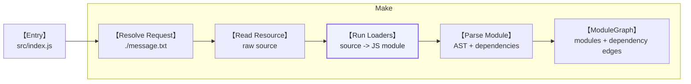

## Why am I doing it?

Sevral weeks ago, I planed to spend some focused time building Feopack's loader system.

> BTW, why was I suddenly working on feopack again?
> Maybe some people were too harsh about how rarely I update my blog.
> Well, let me try to do it better than annually :D

Before jumping into the deep end of loaders, I wanted to learn from a better design first, and Rspack is the good reference, and actually Feopack is the simplified version of that. Otherwise my own design might end up being too wild and crazy to be accepted by the industry.

In my past blog, Feopack already had the rough build lifecycle: `make`, `seal`, and `emit`. That is enough to explain the skeleton of a bundler, but that's not cool enough.

The next missing piece is not a more clever chunk algorithm yet. It is the ability to take a file that is not plain JavaScript, run it through a small transformation pipeline, and let the rest of the compiler treat the result as a normal module.

That is what loader expected to do. 

Here is the story line I plan to write, and I will tell my understanding about loaders in the order:

> It could change because it's just a draf at yet

```
1. Why loader should come before a plugin system in Feopack.
2. Where loader execution belongs in the build pipeline.
3. What Rspack roughly does, without trying to copy every historical detail.
4. What a minimal Feopack loader runner should look like.
5. How a text loader can prove the pipeline works.
6. Why `pitch`, resource queries, and virtual modules exist.
7. What I should deliberately not build yet.
```

## So, what do loaders do?

In the `make -> seal -> emit` lifecycle, loaders belong to `make`.

More precisely, they sit inside the module build step. The compiler resolves a request, reads the resource, applies matching loaders, and only then parses the transformed source as a module.



So a loader is not a late code generation trick. It is part of building a module.

For example, suppose we have a text file that starts as raw text:

```txt
hello loader
```

As we all know, importing a `.txt` file directly in JavaScript does not work.
But with a loader, we can make it possible:

```js
import txt from './hello.txt'

console.log(txt) // "hello loader"
```

And the idea is pretty simple. Since the whole process runs inside Rust or Node.js, the compiler can read the `.txt` file, get its content, and transform that content into JavaScript source code.

```rs
// context = readFile('./hello.txt')
pub fn text_loader(context: LoaderContext) -> Result<String, String> {
  Ok(format!("export default {:?}", context.source))
}
```

The loader turns the text file into a JavaScript module. You can think of that generated module as a virtual file whose content looks like this:

```js
export default 'hello loader'
```

So finally, JavaScript can import and consume it like a real module file.


> Actually, this is not exactly how my current implementation transforms the code.
> I first tried to do it through SWC, but SWC does not give me a convenient helper for this specific rewrite.
> And yes, I am lazy, so I changed the loader implementation itself instead.
> That is not a big deal though. The text above still explains the mechanism well.


todo!()

## Why loader before plugins?

At first, plugin systems sound more important.

Webpack has hooks everywhere. Rspack also needs hook compatibility because a large part of the ecosystem expects to extend the compiler through plugins. If I want to learn Rspack, it is very tempting to jump directly into hooks, lifecycle taps, and plugin registration.

But for Feopack, loader is the better next step.

A loader has a very concrete job:

```txt
resource path + source code -> transformed source code
```

That makes it easier to test. If I import a `.txt` file, I should be able to transform that text into a JavaScript module. If I import a `.css` file later, I can decide whether it becomes injected style code, extracted asset content, or something else. The important part is that the compiler can keep walking the module graph after the transformation.

Plugin is wider. It can touch compiler options, compilation state, module creation, asset generation, optimization, emitting, and probably several other places where future me will ask present me why I left so many trapdoors open.

So the order is simple: loader first, plugin later.

Loader teaches one module how to become another module. Plugin teaches the whole compiler how to be interrupted.

## Where should loaders run?

The cleanest place is inside `make`, during module building.

The rough order should be:

```txt
resolve request
read resource from disk
run matching loaders
parse transformed source
collect dependencies
add module to module graph
enqueue discovered dependencies
```

The key detail is that dependency collection must see the transformed source, not the raw file content.

If `message.txt` is imported from JavaScript, the parser should not try to parse raw text as JavaScript. The text loader should turn it into something like this first:

```js
const __feopack_text__ = "hello from text";
export default __feopack_text__;
```

Then Feopack can parse the generated JavaScript like any other module.

This also explains why running loaders again during code generation would feel wrong. Code generation should consume the module data produced during `make`. It can render the transformed module into the final bundle, but it should not rediscover the original resource and transform it a second time.

In a more mature implementation, this intermediate result should live on the module itself, not as a random temporary field floating around the compilation. A module is not just a file path. It is the compiler's memory of that file after resolution, loading, transformation, and dependency analysis.

## So, what does Rspack do?

Rspack's implementation is much more layered than Feopack needs to be right now, but the broad idea is still readable.

The compiler does not simply read a file and parse it directly. A request goes through module factory logic, gets resolved into a resource, finds matching rules, runs loaders, and only then becomes a module that can be parsed and added to the graph.

In a very simplified shape:

```txt
request
  -> NormalModuleFactory
  -> resolve resource
  -> match module rules
  -> 🌟 run loaders
  -> build module
  -> parse dependencies
  -> ModuleGraph
```

This is the part I want Feopack to learn from Rspack:

1. Loader execution belongs to module building.
2. Loader output becomes the module source that the parser sees.
3. The module should remember enough build result data for later phases.
4. The pipeline should stay extensible without making the MVP unreadable.

And this is the part I do not want Feopack to copy yet:

1. Full webpack-compatible rule syntax.
2. Inline loader request syntax like `style-loader!css-loader!./a.css`.
3. Complete loader context APIs.
4. Cache invalidation.
5. Source map chaining.
6. Pitch loader behavior.

Those are real problems, just not today's problems.

## The minimal Feopack loader runner

For now, I want the loader system to have three small concepts.

First, a rule:

```rust
pub struct LoaderRule {
  pub test: String,
  pub use_loaders: Vec<String>,
}
```

Second, a loader registry:

```rust
pub type Loader = fn(resource_path: &Path, source: String) -> Result<String, String>;
```

Third, a runner:

```txt
find first matching rule
run its loaders from right to left
return transformed source
```

The right-to-left detail follows webpack's normal loader convention. If the rule is:

```txt
use: ["style-loader", "css-loader"]
```

then `css-loader` handles the source first, and `style-loader` consumes the JavaScript produced by `css-loader`.

Feopack does not need all of that for a text loader, but keeping the direction correct now avoids building a backwards mental model.

## The text loader as the first proof

The first useful loader does not need to be clever.

It can take this file:

```txt
hello loader
```

and turn it into this module:

```js
const __feopack_text__ = "hello loader";
export default __feopack_text__;
```

Then user code can write:

```js
import message from "./message.txt";

console.log(message);
```

This test proves several things at once:

1. Feopack can resolve a non-JavaScript resource.
2. The loader can transform raw file content into JavaScript.
3. Dependency scanning happens after loader transformation.
4. Code generation can bundle the transformed module result.

That is a small feature, but it touches the real compiler path. This is exactly the kind of TDD case I like for Feopack: tiny surface area, real architectural pressure.

## Where should the loader result live?

Right now, the temptation is to add a field wherever it is convenient.

That is fine for a first spike, but the more Rspack-shaped answer is that module build output should belong to the module's build state.

A source file goes through several identities:

```txt
raw resource on disk
  -> loaded source
  -> transformed source
  -> parsed module
  -> codegen-ready module
  -> rendered asset fragment
```

These are not all the same thing.

If Feopack stores only the original file path and keeps recomputing everything from disk, later phases become harder to reason about. If Feopack stores one giant `module_result` field on `Compilation`, the system works for a while but starts to feel like a drawer full of unlabelled cables.

The next improvement should probably be a clearer module build result:

```rust
pub struct ModuleBuildResult {
  pub original_source: String,
  pub transformed_source: String,
  pub dependencies: Vec<RawDependencyRecord>,
}
```

This is still not a production design. It is just enough structure to say: `make` owns module building, `seal` consumes the module graph, and code generation consumes already-built module data.

That separation matters more than the exact struct name.

## What about resource queries?

This is where things become interesting.

A real loader system does not only deal with plain file paths. It often deals with requests that include query-like metadata:

```txt
./App.vue?type=template
./App.vue?type=script
./App.vue?type=style&index=0
```

At first this looks like a hack. Then it starts to look like a very useful hack.

The same physical file can produce several logical modules. A Vue single-file component is the classic example: one `.vue` resource can be split into script, template, and style parts. Each part may then go through a different loader pipeline.

For Feopack, I probably do not need a complete Vue loader. But I do want the data model to leave room for this shape:

```rust
pub struct ModuleRequest {
  pub resource_path: PathBuf,
  pub query: Option<String>,
}
```

That one extra `query` field may be enough for a learning implementation. It lets Feopack distinguish `App.vue` from `App.vue?type=template` without pretending they are the same module.

## What is pitch?

todo!()

## Virtual modules and child requests

todo!()

## Loader context APIs

todo!()

## Source maps and caching

todo!()

## The MVP I actually want

The next Feopack target should stay small:

1. Register loader rules from options.
2. Match a resource by suffix.
3. Run loaders during module build in `make`.
4. Store the transformed source as module build output.
5. Parse dependencies from transformed source.
6. Add one playground case for importing text.

After that, I can decide whether the next chapter should be about `pitch`, resource queries, or the plugin system.

For now, the rule is simple: make the compiler learn one small trick, then explain why that trick belongs in the architecture.
